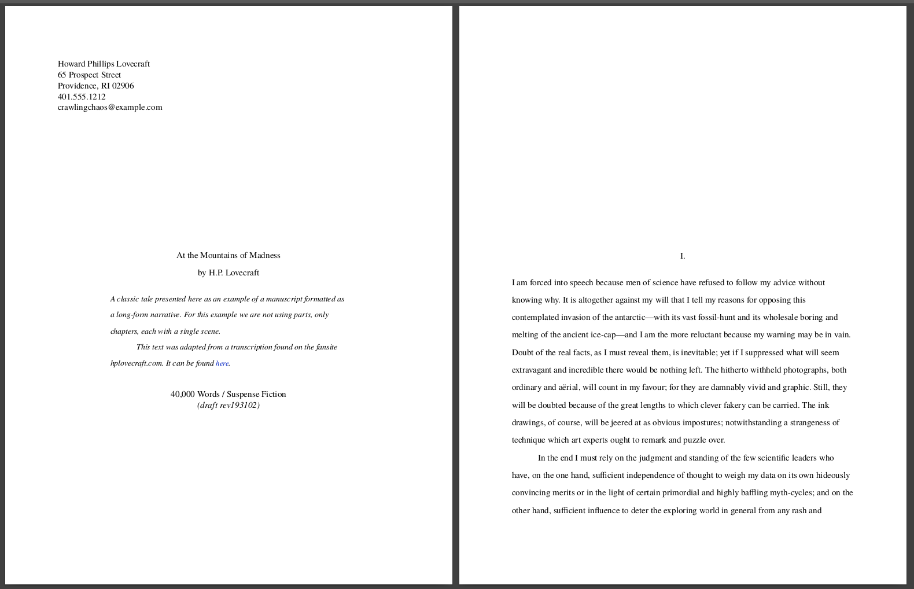
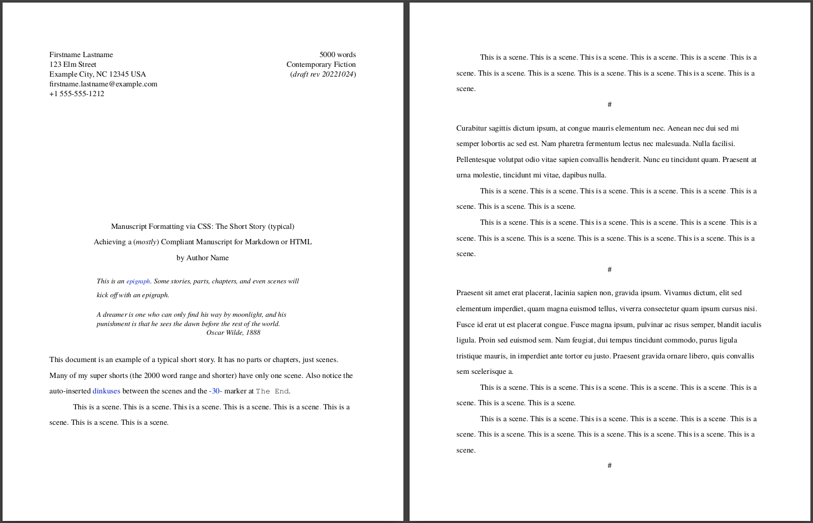
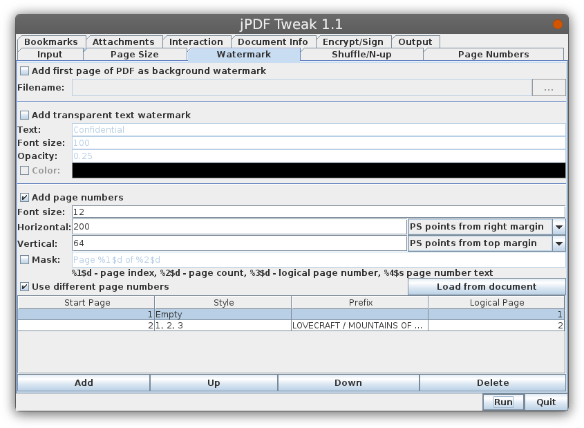

# Manuscript Formatting (CSS) for Markdown for Writers

_Draft your novel or short story in markdown, then export it for review or
presentation in an industry standard manuscript format._

Are you a writer? In particular a narrative writer? Fiction, narrative
nonfiction, memoir, personal narratives, etc.? Do you draft using a markdown
text editor? And do you wish to share your drafts in a professional manner
without having to jump tool chains? Save the fancy office word processors like
LibreOffice or Google Docs or Word for submission finalization. Now, you can
stay in your favorite markdown editor and still have a means to present your
working drafts in a professional manner for review, critique, or whatever.

## What do you mean by manuscript formatting?

Take a look at the example PDFs in the [examples folder](./examples/) in
this repository. Those are examples of how manuscripts are formatted: no fluff,
easy to read and review. Here are some screenshots of the results . . .

<a href="misc/README-short-story-poe.png"></a>
<a href="misc/README-long-story-lovecraft.png"></a>
<!--  -->
<!--  -->

<div style="clear: both;"></div>



<div style="clear: both;"></div>

### Supported formatting

1. A generalized manuscript format for prose (both narrative and non-narrative) and
   for poetry
3. Formatting to produce US Letter- or A4-dimensioned artifacts (PDFs)
4. Short-form works (e.g. short stories or single-poem manuscripts) and
   long-form works (novel and book-sized / poetry chapbooks and collections)
5. A lot of customization if you know your CSS.

## What this does not support

- Nuanced out-of-the-box customization.
- Prose: No `Lastname / Short Title / Page number` in the headers of page 2 and
  onward. Not yet anyway. Waiting for
  [margin at-rules](https://www.quackit.com/css/at-rules/css_top-right_at-rule.cfm)
  to be finally supported (currently a w3c working draft spec.) At the minimum,
  page numbers make life easier for reviewers when giving feedback. One way to
  do that is to use something like
  [jPDF Tweak](https://jpdftweak.sourceforge.net/) (there are a lot of online
  tools as well that do this). It has an ancient interface, but it works. You
  just have to be OK with approximating the header placement and helvetica font
  as your only choice. Look in the [examples folder](./examples/) after I added
  manuscript page headers to the Lovecraft story. This screenshot shows what I
  did to enable it.

  <a style="width: 25%; margin: 8px auto;" href="misc/README-screenshot-jPDF-Tweak.png"></a>

- Poetry manuscripts won't have 2nd page+ of poem continuation blocks. Again,
  maybe in a few years as CSS matures.
- There is a bug with page breaking. The CSS is configured to disallow page
  breaking in weird places, like between a chapter title and the prose, but
  those rules are ignored. I don't know why. In `manuscript.css`, there
  are some special-case stylings available to force the issue. Namely, the
  classes `force-break-before` and `force-break-after`.

> Just remember, when you submit to an editor, they will likely have very
> specific requirements for the format of your manuscript. The rule is: submit
> in whatever format they demand (you will likely have to port the document
> to `.odt` or `.docx` format). This is not for that.

## I want to produce a book from my writing

This is not for that. This is for creating a professional reviewable document
in an industry-standard format.

To produce a book, when you have finished or are close to finishing your
drafting process, port your document from markdown to LibreOffice, Word, or
Google Docs and either submit that to an editor or import that into a book
production application like [Reedsy](https://reedsy.com/write-a-book).

Another possibility is to port the markdown to
[Bookdown](https://www.bookdown.org/). Bookdown, though very intriguing, also
looks rather daunting and is geared for the academic community.

## How do I construct a manuscript from my markdown document?

**TL;DR:** check out the example manuscripts in this repository in their
original markdown and then as PDFs. Use one of the [examples](./examples/) as a
template for your own work.  And if you are already familiar with converting
markdown to HTML to PDF then that should be enough to get you going.

## How? With more detail

#### Process summary:

(1) write your document in the prescribed structure, (2) convert it to HTML,
and then (3) convert that to PDF.

If you use [Joplin](https://joplinapp.org) for your markdown editing, you use
the application's built in previewer for the "convert to HTML" step. And then
you directly produce a PDF from within the application.

Otherwise, you convert to HTML with Pandoc and then PDF via a browser.

Or you render a preview of your markdown fie in Chrome (a preview is really a
conversion to HTML) using the
[Markdown Viewer](https://chrome.google.com/webstore/detail/markdown-viewer)
extension and then `CTRL-P` > `Save as PDF`.

#### Process summary - more detailed:

0. Download this repository.
   - From the command line using `git`:
     1. Copy (clone) the repository:
        `git clone https://github.com/taw00/manuscript-css/`
     2. `cd manuscript-css`

   - From the GitHub UI:
     1. browse to <https://github.com/taw00/manuscript-css/>
     2. `Code` (big blue button) > `Download zip`
     4. Unzip the `manuscript-css-main.zip` file.
     5. Change that name to `manuscript-css` if you like.
     6. `cd manuscript-css'

1. Copy one of the templates from the templates directory, renaming it to
   whatever makes sense to you.
2. Open that markdown document in your favorite editor.  
   I recommend the [Joplin](https://joplinapp.org) desktop note-taking
   application. It has the most seamless user experience.
3. Replace the templated content with yours
4. Write your story, scene by scene.
5. Convert to HTML using Pandoc (or preview natively in the Joplin application)
6. Review the HTML in your favorite browser (or preview natively in the Joplin
   application)
7. If not to your satisfaction, revise your document  
   and repeat from step 5 - rinse; repeat until done.
8. Convert to PDF by using `Print to file` from your browser (or export
   natively from within the Joplin application)

If you have an existing document already in markdown format, just examine
the [templates/examples](./examples/) and refactor your document accordingly.

## Rendering your markdown to HTML for review (step 5 above)

### If using Joplin as your markdown editor, just use the previewer (skip to step 6)

> Note, to use Joplin, you have to `File` > `Import` the markdown file, of
> course, and then you'll have to change the `@import` to include the full path
> to the `manuscript.css` stylesheet.

Click the `Toggle Editor Layout` button in the upper-right-hand corner of the
application. There you have it. The HTML preview of the document. It's as
accurate a presentation as your browser would present.

### If using any other editor

#### The cleanest method: Pandoc

This requires you use the command line and to have Pandoc installed,
<https://pandoc.org/>.

1. Convert your markdown file to HTML (step 5)  
   In this example (really only `-V` and `--metadata` are optional):

- `-s` means standalone rendering
- `-V lang=en` inserts the correct locale info in the HTML head element.
  Change `en` to your locale.
- `--no-highlight` means to not do any syntax highlighting.
- `-f markdown-native_divs+raw_html` tells pandoc to trust our markup and not
  "autofix" certain things (that then break our markdown).
- `--metadata title="YOUR TITLE"` sets the HTML title.
- `-o filename.html` sets the output filename

```plaintext
pandoc -s -V lang=en --no-highlight -f markdown-native_divs+raw_html \
  --metadata title="TITLE" \
  -o lastname.TITLE.manuscript.html lastname.TITLE.manuscript.md
```

2. Use your browser to review that HTML (step 6)

```plaintext
file:///fullpath-to-the-document/lastname.TITLE.manuscript.html
```

> **A note about the HTML rendering of a long-form manuscript.**
>
> By default, simulated page breaks are inserted (dotted lines) in the HTML
> where they would occur when converted to a PDF. Also, large positioning gaps
> are squashed. When the document is rendered to PDF, the dotted lines will be
> removed and, of course, the correct positioning will be rendered. That faint
> margin border also disappears.

#### A simpler method: the Markdown Viewer extension for Chrome

Simpler, but does introduce possible formatting oddities. I feel it work nearly
perfectly.

1. Install this: <https://chrome.google.com/webstore/detail/markdown-viewer>
2. Click the puzzle-piece and pin the entension to the browser bar
3. Click the M icon and turn on allowing opening local files. See
   <https://github.com/simov/markdown-viewer>
4. Browser to a `.md` file on your system and it should render it perfectly as
   HTML. Then you are ready for the next step.

## Rendering your markdown to PDF (step 8)

### If using Joplin

`CTRL`-`SHIFT`-`E`

Or, in the top menus of the application: `File` > `Export All` > `PDF - PDF File`

Then use your favorite PDF viewer or browser to view the file.

### If reviewing the HTML from a browser

`Print` (CTRL-P) > `Save to PDF`

Then use your favorite PDF viewer or browser to view the file.


> _Note1: **Chrome-based browsers manage the fonts better for export to PDF.**
> So, I recommend using one of them for review and then export to PDF. This is
> one of the few times I recommend Chrome over Firefox._

> _Note2, Though Pandoc can produce a PDF, its renderings are not accurate.
> Joplin and your web browser do a far better job._

That's it! Congrats!

Questions? Comments? Post them in the Discussions section of this repository.  
-todd

---
---

## Other things

### Todd is a Joplin shill!

Nope. It's just the best option for this kind of work. IMHO.

The great majority of markdown editors (see a selection and my thoughts later
in this document) are great at editing text. Many can also preview your work,
but they are only particularly good at showing you a prettier version of the
text and not a fully customized rendering. This is fine if you just want nice
looking notes and things. But not fine if you want _very specific_ looking
notes and things. Generating a manuscript view of your document is a very
specific look.


This is where the [Joplin](https://joplinapp.org) note-taking application rises
above its peers. Yes, your notes and documents look nice out of the box, but
you also have the full ability to customize the results to your hearts content
using standard CSS. Joplin is also a great personal document-management
platform. And it can sync to the cloud. And you can publish things to the cloud
for anyone to view. And it is fully end-to-end encrypted.  And it has a
web-clipper (super handy!!!) and a mobile app. So, yes, I suppose I am a Joplin
shill. But for all the right reasons.

But I also use other editors out there. I use Vim, Xed, Marktext, and sometimes
Obsidian. I am sure you have your preferred interface. Install Pandoc and
follow the steps above. It's not complicated.

### What's completely untested

- Tables
- I have also done no styling for images. If you want to add images to your
  document, you are on your own. For now. I'll probably play with that in the
  future.
- I have tested `manuscript.css` with only a couple markdown environments. Some
  editors change the look and feel of certain elements, so just be aware. Since
  I overload the purpose of Joplin when I draft, I had to create a set of CSS
  to squash all of its Joplinisms when I render the document. Let me know what
  you see out there in the wild.
- Using this with HTML instead of markdown. Well, it should just work, I just
  haven't tried it. I mean, markdown, in the end, is really just HTML with a
  bit of varnish.

### For the Future

- The one big missing feature is, as I mentioned above, support for a per-page
  header with `LASTNAME / SHORT TITLE / PAGENUMBER` in the upper-right-hand
  corner. If I can get that working (via JavaScript maybe?) I may be able to
  never leave markdown, even for submissions (assuming they accept PDF). I
  mention this again because it annoys me.
- More options for the placement of `.m-facts`.

### My writer's workflow:

1. 0-draft: either in markdown or handwritten
2. work-in-progress: markdown drafting via the Joplin desktop application
   <https://joplinapp.org>. (_Joplin is a note-taking software application that
   also serves as an excellent general purpose markdown editor._)
3. review by other: I periodic share drafts or portion of a drafts with
   critique partners, alpha readers, and beta readers. For this, I also use
   Joplin's excellent Joplin Cloud service which has a really convenient
   publish-to-the-web feature.
4. submission for publication: I port my markdown over to LibreOffice writer. I
   developed a manuscript template and it doesn't take me long to convert my
   markdown to LibreOffice, do a final proofread, and then submit a `.docx`
   file.

---

### My thoughts on various text-based writing platforms . . .

#### Editors for Writers

- [Joplin](https://joplinapp.org): I've already sung Joplin's praises. But it
  is, IMHO, the far superior application for developing text-heavy context.
  Joplin provides a WYSIWYG editor as well as a text editor. Its included text
  editor is modest, but it can open a "note" in any editor you want that can be
  called from the command line. Finally, **it is the one and only editor here
  that can go from text markdown to HTML to PDF without using a separate
  tool.**
- [Obsidian](https://obsidian.md/): Obsidian is similar type of application as
  Joplin. It has a more modern vibe. I actually have used Obsidian and Joplin
  side-by-side for some time, but I keep going back to Joplin. Joplin is just a
  more complete solution. Obsidian is more useful as a
  [Zettlekasten](https://en.wikipedia.org/wiki/Zettelkasten) application for
  management of your ideas, thoughts, and mental bookmarks. It's pretty slick.
  Check it out. As a markdown editor, it's okay. But it too can open files for
  edit in a text editor of your choosing.
- [GhostWriter](https://ghostwriter.kde.org/): great editor. It previews
  manuscript-formatted markdown incorrectly, but exports to HTML just fine. It's
  a half solution. It also had writer-friendly features like focus mode, etc.
  Skip it's previewer. Edit with Ghostwriter, export to HTML, and preview in
  a browser. It saves you a step in that you don't have to use Pandoc directly.
  BUT! To export to HTML, it needs Pandoc installed.
- [Marktext](https://github.com/marktext/marktext): Man, I really like this
  editor as a writer's editor. Super simple and distraction free.
- [Bear](https://bear.app/) and [Typora](https://typora.io/): I heard good
  things about these, but I don't use any Apple products so, I have never tried
  them.
- All the minimalistic note-taking software applications out there—just avoid
  them. They are a waste of your time except to jot down ideas to be
  transferred later.

#### General purpose text/programming editors

- [Xed](https://github.com/linuxmint/xed): a great just-enough-features
  lightweight text and code editor. I use Xed all the time.
- [Text Editor](https://chrome.google.com/webstore/detail/text-editor/demheclfdlemkkpadenmajhjbdhbjjml?hl=en-US&utm_source=chrome-ntp-launcher)
  Chrome Web App: This is actually a rather great bare-bones editor.
- [Vim](https://www.vim.org/): Vim is hugely powerful and designed for hardcore
  programmers. If you know what you are doing you can make it do anything, and
  do it far more efficiently than the rest of these editors, including
  automating the preview in HTML step. But Vim has a steep learning curve. I
  have used it for decades, but, yeah, a steep learning curve. Vim is a
  terminal program, but it also has a graphical version: `gvim`.
- [VSCode](https://code.visualstudio.com/Docs/languages/markdown): A very
  popular code editor. And very much like the once-popular Atom editor. VSCode
  also has an excellent previewer and a great
  [Joplin plugin](https://joplin-utils.rxliuli.com/joplin-vscode-plugin/)!
  Unfortunately, you can't take advantage of @importing manuscript.css locally
  using VSCode. It's security model disallows it. But you can leverage it if
  you use `manuscript.css` via an https connection. VSCode's Markdown
  All-in-One extension can export to HTML, negating a need to use Pandoc.
- [Atom](https://atom.io/): AVOID. The project is
  **[shutting down](https://github.blog/2022-06-08-sunsetting-atom/)** Atom is
  great general purpose code editor but can get really complicated to use. And
  it's markdown capabilities are both powerful but at the same time fall very
  short or our needs. Microsoft (who now owns the project) is shutting it down,
  Dec 2022. I only list this because it's on every markdown editor list out
  there. VS Code is essentially Atom's successor.

---
---

## Structure summary of a manuscript drafted in markdown

#### Example 1: The document beginning - default format and behavior

_Note that "manuscript.css" here is a stand-in for
"/path/to/manuscript-css/manuscript.css". Or if you decide to host it on some
webserver, "https://yourwebsite.com/pub/css/manuscript-css/manuscript.css"._

```markdown
<!-- Formatting: US letter, 1in margins, short-form narrative -->
<style>
    @import "manuscript.css";
</style>
<div id="vpage">
<article id="manuscript">
... your manuscript ...
```

#### Example 2: The document beginning - same as above with behavior adjustments

```markdown
<!-- Formatting: A4, 25.4mm margins, long-form non-narrative          -->
<!--             I.e. All the big switches reversed from the default. -->
<style>
    @import "manuscript.css";
    @page { size: A4 portrait; margin: 25.4mm; }
</style>
<div id="vpage">
<article id="manuscript" class="A4 long non-narrative">
... your manuscript ...
```

### Example 3: The high-level containers

`manuscript.css` structures the document into parts, chapters, and scenes. And
if poetry, parts, chapters and poems. In the end, parts and chapters are not
absolutely required. The meat of your manuscript lives either in a scene or a
poem. Most short stories, for example, only use scenes. Often only one scene
container.

Let's look at the containers in summary, and then we'll dive into a little
depth afterward.

#### The containers in summary (prose-focused)...

```markdown
<style>
    @import "manuscript.css";
</style>
<div id="vpage">
<article id="manuscript" class="prose narrative">

<!-- suggested: contact name, address, email, phone -->
<div id="m-contact">
</div>

<!-- suggested: title, subtitle, by Author, wordcount/genre facts, and
     epigraph -->
<div class="m-header">
<div id="m-facts">
</div>
</div>

<!-- optional: part - parts contain chapters -->
<section class="part">
<!-- suggested: part title - rare: subtitle, by Author, epigraph -->
<div class="m-header">
</div>

<!-- optional: chapter - chapters contain scenes (or poems) -->
<section class="chapter">
<!-- suggested: chapter title - rare: subtitle, by Author, epigraph -->
<div class="m-header">
</div>

<!-- required (for prose): scene - scenes contain your prose
     An example of three scenes -->
<section class="scene">
<!-- unusual: scene title, subtitle, by Author, epigraph -->
<div class="m-header">
</div>
</section>

<section class="scene">
<div class="m-header">
</div>
</section>

<section class="scene">
<div class="m-header">
</div>
</section>

</section></section>
</article>
</div>
```


#### The container `<div id="m-contact">`

The `m-contact` container is for your author or agent contact info. Example:

```markdown
<div id="m-contact">

Todd Warner

123 Main St

Example Town, NC 27560

email@example.com | +1 555-555-1212

</div>
```

#### The container `<div class="m-header">`

One exists at the top level for the title and whatnot of the work. Then each
part, chapter, and scene can also optionally also have titles and things.

Within this container, `h1` (`#` in markdown), `h2` (`##`), `h3`
(`###`), and `blockquote` (`>`) are overloaded to represent ...

```markdown
<div id="m-header">

# Title of Story

## Subtitle of Story

### by Firstname Lastname

> An epigraph for my story. _There is nothing to writing. All you do is sit
> down at a typewriter and bleed._ —Ernest Hemingway

<div id="m-facts">

2000 words

Literary Fiction

(_draft rev. 20221029_)

</div>
```

**What's an epigraph you ask?** <https://en.wikipedia.org/wiki/Epigraph_(literature)>

Note, the `m-header`s in the parts, chapters, and scenes don't usually have `m-facts`.

#### Fonts / Typefaces

The default fonts used by the manuscript are ones selected to conform to what
is expected—namely Times New Roman close equivalents, but also Arial and
Courier New, depending on need.

You really don't need to import new typefaces (your computer should know how to
handle a request for any one of those), but if you want to explore my open
source font recommendations, just add these imports to the top of your
manuscript (adding the path as needed, of course):

```markdown
<style>
    @import "typeface/typeface-serif-termes.css";
    @import "typeface/typeface-serif-tinos.css";
    @import "typeface/typeface-sans-arimo.css";
    @import "typeface/typeface-mono-cousine.css";
    @import "manuscript.css";
</style>
```

### Poetry!

To insert a poem in a document arbitrarily, it will be structured like this:

    <div class="x-poem">

    ```plaintext
       Poem stanza
           Here.
    ```
    ```plaintext
       Poem stanza
           Here.
    ```
    </div>

- If your document is a manuscript for a single poem, `#manuscript` will be of
  `class="short poetry"` and instead of a `.m-chapter` + `.m-scene`, you will
  have an _empty_ `.m-chapter` + a solitary `.m-poem` filled with ```plaintext
  stanzas similar to `.x-poem` above.

- If your document is a manuscript for a single poem, `#manuscript` will be of
  `class="short poetry"` and instead of a `.m-chapter` + `.m-scene`, you will
  have an _empty_ `.m-chapter` + a solitary `.m-poem` filled with ` ```plaintext`
  stanzas similar to `.x-poem` above.

## Good luck!

Check out the example manuscripts in this repository and I think how everything
works with `manuscript.css` becomes obvious.

Good luck. Now, quit fooling around on the internet and write something.

Copyright (c) Todd Warner <t0dd@protonmail.com>
This work is licensed under Attribution 4.0 International. To view a copy
of this license, visit http://creativecommons.org/licenses/by/4.0/

---
---

## Addendum

### General manuscript formatting guidelines

Please note, again, that manuscript formatting is a loose standard and
ultimately governed by to whomever you are submitting. For example, if a
publishing house demands the typeface by Comic Sans, you format your manuscript
in Comic Sans.

Here are some general guidelines.

#### Novels

- <https://www.shunn.net/format/novel/>
- <https://graemeshimmin.com/manuscript-format-for-novel-submission/> A4!
- <https://blog.reedsy.com/guide/book-manuscript-format/>

#### Novellas

- <https://www.shunn.net/format/2009/03/proper_novella_format.html>

#### Short Narratives

- <https://www.shunn.net/format/story/>

#### Poetry

- <https://www.shunn.net/format/poetry/>
- <https://www.masterclass.com/articles/how-to-format-and-submit-your-poetry-manuscript>
