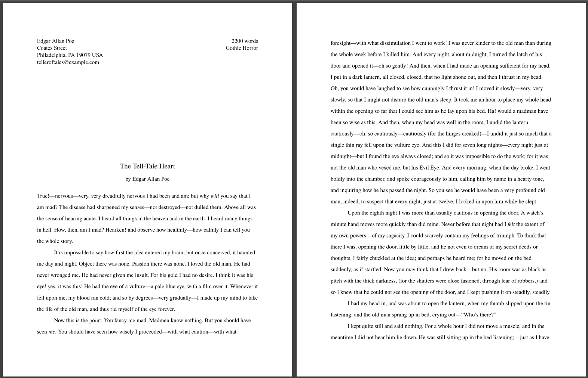

# Manuscript Formatting (CSS) of Markdown for Writers

_Draft your novel or short story in markdown, then export it for review or
presentation in an industry standard manuscript format._

Are you a writer? In particular a narrative writer? Fiction, narrative
nonfiction, memoir, personal narratives, etc.? Do you draft using a markdown
text editor? And do you wish to share your drafts in a professional manner
without having to jump tool chains? Save the fancy office word processors like
LibreOffice or Google Docs or Word for submission finalization. Now, you can
stay in your favorite markdown editor and still have a means to present your
working drafts in a professional manner for review, critique, or whatever.

## Manuscript formatting?

Take a look at the example PDFs in the [templates folder](./templates/) in
this repository. Those are templates of how manuscripts are formatted: no fluff,
easy to read and review. Here are some screenshots of the results . . .

<a href="misc/README-short-story-poe.png"></a>
<a href="misc/README-long-story-lovecraft.png"></a>
<!--  -->
<!--  -->

<div style="clear: both;"></div>


<div style="clear: both;"></div>

# This process is . . .

1. A generalized manuscript formatting process for prose and poetry (for prose,
   both narrative and non-narrative)
3. Formatting to produce US Letter- or A4-dimensioned artifacts (PDFs)
4. Formatting that can be adjusted for short-form works (e.g. short-story or
   single-poem manuscripts)
5. Formatting that can be adjusted for long-form works (novel and book-sized /
   poetry chapbooks and collections)
6. Formatting that can be broadly adjusted for non-narrative works
   (non-narrative non-fiction, primarily)
7. A lot of customability if you know your CSS.

# This process is not . . .

## This process is not for book production

This set of stylesheets designed to produce a professional, reviewable document
in an industry-standard format rendered from your markdown. Producing a book is
a different animal.

To produce a book, when you have finished or are close to finishing your
drafting process, port your document from markdown to LibreOffice, Word, or
Google Docs and either submit that to an editor or import the document into a
book production application like [Reedsy](https://reedsy.com/write-a-book) if
you intend to self-publish.

[Bookdown](https://www.bookdown.org/) is another toolset for those who are
self-publishing. Bookdown, though very intriguing, also looks rather daunting
and is geared for the academic community.

## This process is not for producing a 100% compliant manuscript

This set of stylesheets designed to produce a professional, reviewable document
in an industry-standard format rendered from your markdown. But not a
publishing-house-ready document. For that, you will need to port your document
to a wordprocessor. I use LibreOffice, sometimes Google Docs, and Zoho Writer.

Also check out the myriad of authoring platforms out there: Scrivener, Novlr,
LivingWriter, Dabble, Ulysses, Storyist (Apply-only, blech!), Final Draft (for
screenwriters), Quoll Writer (Windows-only and not sure if Quoll Writer can
produce a manuscript), others.

**What's missing?**

Only a few critical bits of formatting are missing that can't be easily fixed
with markdown + CSS.

- Nuanced out-of-the-box customization.  
  Some publishing houses have certain quirky requirements for manuscripts
  during the submission process. If their requirements travel far from the
  generic standard, the process represented here probably won't support that.
- Automated porting to `.odt` or `.docx` file formatting.  
  That process is rather manual, unfortunately. Read more about that in
  [README-structure-summary.md](README-structure-summary.md).
- (Prose) No `Lastname / Short Title / Page number` headers from page 2
  onward.  
  Not yet anyway. Waiting for
  [margin at-rules](https://www.quackit.com/css/at-rules/css_top-right_at-rule.cfm)
  to be finally supported (currently a w3c working draft spec.)

> One possible solution is to add those headers to the generated PDF. There are
> many online tools that enable this. But a desktop-based tool, at least for
> linux users is [jPDF Tweak](https://jpdftweak.sourceforge.net/). It's an
> ancient and inflexible application, but it works. You
> just have to be OK with approximating the header placement and with the
> helvetica typeface as your only choice. Look in the
> [templates](./templates/) folder after I added manuscript page headers to the
> Lovecraft story. This screenshot shows what I did to enable it.

<a href="misc/README-screenshot-jPDF-Tweak.png"></a>

- (Poetry) No 2nd page+ of poem continuation blocks.  
  Again, maybe in a few years as CSS matures.
- Page break avoidance is buggy.  
  The CSS is configured to disallow page breaking in weird places, like between
  a chapter title and the prose, but those rules are ignored. I don't know why.

# TL;DR Just show me how to do it!

Check out the example manuscripts in this repository in their original markdown
and then as PDFs. Use one of the [templates](./templates/) as a template for your
own work.  And if you are already familiar with converting markdown to HTML and
then HTML to PDF then that should be enough to get you going.

## Process summary - super high-level

(1) write your document in the prescribed structure, (2) preview it in HTML,
(2.5) potentially save it as an HTML file, and then (3) convert the document to
PDF.

**Step 1** is done with any editor: Joplin, VSCode, Ghostwriter, Xed, Vim, etc.
Even Notepad if you like.

**Step 2** is done natively with Joplin, VSCode, or the Chrome browser. Or
converted to HTML with Pandoc.

**Step 2.5** is done natively with VSCode or Pandoc

**Step 3** is done natively from Markdown with Joplin or the Chrome browser, or
From from HTML via a Chrome browser.

> **A note about the HTML rendering of a long-form manuscript using this
> stylesheet.**
>
> An HTML rendering is not a paged format. Therefore the HTML rendering of the
> manuscript will always be an approximation of a paper or PDF document.  A
> simulation. Which is fine for the purposes of critique and review. By
> default, simulated page breaks are inserted (dotted lines) in the HTML where
> they would occur when converted to a PDF. Also, large positioning gaps are
> squashed just to make it easier to view. When the document is rendered to
> PDF, the dotted lines will be removed and, of course, the correct positioning
> will be rendered. That faint margin border also disappears.

**The process, with more detail . . .**

## Process summary - prepping this repository for use

Download this repository.

- From the command line using `git`:

  1. Copy (clone) the repository:
     `git clone https://github.com/taw00/manuscript-css/`
  2. `cd manuscript-css`

- From the GitHub UI:
  1. browse to <https://github.com/taw00/manuscript-css/>
  2. `Code` (big blue button) > `Download zip`
  4. Unzip the `manuscript-css-main.zip` file.
  5. Change that name to `manuscript-css` if you like.
  6. `cd manuscript-css'

And if you own a webserver somewhere. Stick this repo in your /pub/ directory
so you can import over the web.

## Process summary - Step 1 - editing markdown manuscript

It's easier to work with a template than from scratch.

1. Copy one of the templates from the [templates directory](./templates/),
   renaming it to whatever makes sense to you. If you have an existing document
   already in markdown format, just examine a template and refactor your
   document accordingly.
2. Open that markdown document in your favorite editor.
3. Replace the templated content with yours
4. Write your story, scene by scene. (Or poetry collection, poem by poem.)

## Process summary - Steps 2-3 - processing that markdown

*Rendering to HTML for review or presentation and then to PDF.*

### Joplin: edited markdown to exported PDF

*(1) editing, (2) previewing, and then (3) rendering a PDF*

If you use [Joplin](https://joplinapp.org) for your markdown editing, use
the application's built in previewer for the "convert to HTML" step. And then
later, if you so choose, you can directly produce a PDF (`CTRL-SHIFT-E`) from
within the application.

> Click the `Toggle Editor Layout` button in the upper-right-hand corner of the
> application. There you have it. The HTML preview of the document. It's as
> accurate a representation as your browser can produce.

If you want the end result to be an HTML file on disk, then you will need to use
Pandoc to do that. See below. Joplin does have markdown to HTML functionality,
but you have to export every document in your Joplin application to HTML and
then pick out the one in question. Joplin is seamless at previewing and then
exporting to PDF. Not so much to HTML on disk. Personally, I use the
[Joplin Cloud](https://joplincloud.com) publish functionality to skip straight
to producing a publicly viewable manuscript.

### VSCode: edited markdown to exported HTML

*(1) editing, (2) previewing, and then (2.5) exporting to HTML*

> **A BIG CAVEAT WITH VSCODE**: VSCode blocks importing (`@import`) from the
> filesystem. If you want to use the previewer and renderer in VSCode, you will
> have to host the `manuscript-css` folder on the web somewhere. Or in the
> meantime, as of this writing, just use my instance:
> `@import "https://toddwarner.io/pub/css/manuscript/manuscript.css";`
> That is not guaranteed to be a functional link forever though.

Install (`CTRL-SHIFT-X`) these extensions: `Markdown All-in-One`,
`Markdown Preview Mermaid Support`, `Markdown Footnotes`, and
`Markdown Superscript`.

To preview the HTML: `CTRL-k` release then `v`

To export to HTML on disk:  `CTRL-SHIFT-P` and then
`>Markdown All in One: Print current document to HTML`. It will be saved, I
believe, in the same directory as the markdown document.

> Side note. If you are Joplin user but also love VSCode, there is an excellent
> VSCode extension that enables it to plug into the Joplin application
> ecosystem and largely replace Joplin's editor (and some of the front end).
> It's rather excellent, though the @import caveat mentioned above is hugely
> annoying. For that, install the extension `joplin-vscode-plugin` and follow the
> instructions for usage.

### Pandoc: markdown exported to HTML

*Step 2.5: converting a markdown file to an HTML file.*

This requires you use the command line and to have Pandoc installed,
<https://pandoc.org/>.

Edit the markdown document with your editor of choice. Then . . .

Convert your markdown file to HTML:  
(In this example really only `-V` and `--metadata` are optional.)

```plaintext
pandoc -s -V lang=en --no-highlight -f markdown-native_divs+raw_html \
  --metadata title="TITLE" \
  -o lastname.TITLE.manuscript.html lastname.TITLE.manuscript.md
```

- `-s` means standalone rendering
- `-V lang=en` inserts the correct locale info in the HTML head element.
  Change `en` to your locale.
- `--no-highlight` means to not do any syntax highlighting.
- `-f markdown-native_divs+raw_html` tells pandoc to trust our markup and not
  "autofix" certain things (that then break our markdown).
- `--metadata title="YOUR TITLE"` sets the HTML title.
- `-o filename.html` sets the output filename

Note, the filename format is just what I prefer.

> _Note there is a Pandoc limitation that so many folks forget. Pandoc doesn't
> do CSS.  What this means is that converting from Mardown to HTML works just
> fine because Pandoc just passes along your CSS. But Markdown (or HTML) to
> most other formats will have all that fancy CSS just dropped and not
> translated._

### Chrome: markdown or HTML to exported PDF

*markdown (2) previewing as HTML and then (3) exporting a PDF*

Within Chrome, prep it for markdown rendering . . .

1. Install: <https://chrome.google.com/webstore/detail/markdown-viewer>
2. Click the puzzle-piece and pin the entension to the browser bar
3. Click the M icon and turn on allowing opening local files. Reference:
   <https://github.com/simov/markdown-viewer>

Edit the markdown document with your editor of choice.

Then browser to that `.md` file and it should render it perfectly as an HTML
preview.

Finally, of course, if you so choose, you can directly produce a PDF:
`CTRL-P > Save as PDF`

The HTML preview will not be as clean as Joplin's or VSCode's, IMHO, but it is
pretty darn good.

*HTML file exported to PDF*

If you produced an HTML file from Pandoc or VSCode, you open the file in the
Chrome browser . . .

```plaintext
file:///fullpath-to-the-document/lastname.TITLE.manuscript.html
```

and then `CTRL-P > Save as PDF`. That easy.

> _Note1: **Chrome-based browsers manage the fonts better for export to PDF.**
> So, I recommend using one of them for review and then export to PDF. This is
> one of the few times I recommend Chrome over Firefox._

> _Note2, Though Pandoc can produce a PDF, Pandoc doesn't grok custom-CSS.
> Therefore its renderings will not be accurate. Joplin and your web browser do
> a far better job. Pandoc's HTML renderings are solid though since Markdown
> is really just a sping of HTML._

That's it! Congrats!

Questions? Comments? Post them in the Discussions section of this repository.  
-todd

---
---

# Other things

## Todd is a Joplin shill!

Nope. It's just the best application that I have found for this kind of work.
IMHO.

The great majority of markdown editors (see a selection and my thoughts later
in this document) are great at editing text. Many can also preview your work,
but they are only particularly good at showing you a prettier version of the
text and not a fully customized rendering. This is fine if you just want nice
looking notes and things. But not fine if you want _very specific_ looking
notes and things. Generating a manuscript view of your document is a very
specific look.


This is where the [Joplin](https://joplinapp.org) note-taking application rises
above its peers. Yes, your notes and documents look nice out of the box, but
you also have the full ability to customize the results to your hearts content
using standard CSS. Joplin is also a great personal document-management
platform. And it can sync to the cloud. And you can publish things to the cloud
for anyone to view. And it is fully end-to-end encrypted.  And it has a
web-clipper (super handy!!!) and a mobile app. So, yes, I suppose I am a Joplin
shill. But for all the right reasons.

But I also use other editors out there. I use Vim, Xed, Marktext, and sometimes
Obsidian. I am sure you have your preferred interface. Install Pandoc and
follow the steps above. It's not complicated.

## What's completely untested

- Tables
- I have also done no styling for images. If you want to add images to your
  document, you are on your own. For now. I'll probably play with that in the
  future.
- I have tested `manuscript.css` with only a couple markdown environments. Some
  editors change the look and feel of certain elements, so just be aware. Since
  I overload the purpose of Joplin when I draft, I had to create a set of CSS
  to squash all of its Joplinisms when I render the document. Let me know what
  you see out there in the wild.
- Using this with HTML instead of markdown. Well, it should just work, I just
  haven't tried it. I mean, markdown, in the end, is really just HTML with a
  bit of varnish.

## Porting your finished draft to LibreOffice and/or Google Docs

**LibreOffice**

I have included Libreoffice templates in this repository. Copy the templates
into the `$HOME/Templates/` folder.  (Look in `Tools > Options, LibreOffice >
Paths` for your Templates fold location.)

Now, you are going to use Pandoc to generate a functional, but messy
LibreOffice .odt document. Then you will create a fresh document in LibreOffice
from one of the templates. And finally, you will cut and paste text from the
messy document to the new document, adjusting formatting as needed. Not ideal,
but it works and it goes faster than it sounds.

To generate that messy .odt file:

```plaintext
pandoc -o your-manuscript.odt your-manuscript.md
```

To create a nice clean fresh-from-a-template LibreOffice document:
- Open LibreOffice
- `File > New > Templates...` and pick the appropriate template.
- Remove most of the example text, though first make sure you understand what
  things are. These templates are templated as such because they closely match
  Google Docs import/export style names. Looking at all the styles, everything
  under "normal" represents everything in thed document: "normal" is the text
  and other random things. "Heading 1" is for part titles. "Heading 2" is for
  chapter titles. "Heading 6" is for dinkus markers and the -30- marker. You
  will have to figure out how to wedge everything else in if you did a bunch of
  fancy things.
- Either cut-and-paste blocks of text from the "messy .odt" (use
  `CTRL-SHIFT-V`) to the new document. Or, after you get pretty good at this,
  you can find an appropriate spot and import the whole messy document in:
  `Insert > Text from file` . . . and then clean up the mess.

> There is a guy out there who uses Pandoc's reference mechanism (templating)
> to convert markdown to .odt and .docx into a short story manuscript format.
> It's not the worst way of doing things, but I don't care for it. If you want
> to play around with it, check it out
> [here](https://www.autodidacts.io/convert-markdown-to-standard-manuscript-format-odts-docs-and-pdfs-with-pandoc/).

**Google Docs**

Check out my Google Docs templates
[here](https://drive.google.com/drive/folders/1VHZiNtNyCqU3BOJG7sGdywo_8Ag2DcUL).

You can get your document into Google Docs one of two ways: 1. port it to
LibreOffice, generate a .odt and then import that into Google Docs. Or 2. you
could create a new clean document from one of those templates and do the
cut-and-paste shuffle as described earlier.

> Note. Importing and explorting documents into and out of Google Docs is
> error-prone. Google Docs is not the best at this. Office 365 is probably much
> better, but I have never used it. One thing is for sure though, Google Docs
> can import and export .odt better than .docx. Often, Google Docs won't even
> recognize a legit .docx file.
>
> Also, I recommend turning on document conversion:
> `Gear Icon > Settings > General > Convert Uploads`
>
> Finally, I have not played with it a ton, but you can connect and use Zoho
> Writer from within Google Docs and it is a far more featureful application.
> And it can handle importing and exporting better than Google Docs itself.

## For the Future

- The one big missing feature is, as I mentioned above, support for a per-page
  header with `LASTNAME / SHORT TITLE / PAGENUMBER` in the upper-right-hand
  corner. If I can get that working (via JavaScript maybe?) I may be able to
  never leave markdown, even for submissions (assuming they accept PDF). I
  mention this again because it annoys me.
- More options for the placement of `.m-facts`.

## My writer's workflow:

1. 0-draft: either in markdown or handwritten
2. work-in-progress: markdown drafting via the Joplin desktop application
   <https://joplinapp.org>. (_Joplin is a note-taking software application that
   also serves as an excellent general purpose markdown editor._)
3. review by other: I periodic share drafts or portion of a drafts with
   critique partners, alpha readers, and beta readers. For this, I also use
   Joplin's excellent Joplin Cloud service which has a really convenient
   publish-to-the-web feature.
4. submission for publication: I port my markdown over to LibreOffice writer. I
   developed a manuscript template and it doesn't take me long to convert my
   markdown to LibreOffice, do a final proofread, and then submit a `.docx`
   file.

---

# My thoughts on various text-based writing platforms . . .

## Editors for Writers

- [Joplin](https://joplinapp.org): I've already sung Joplin's praises. But it
  is, IMHO, the far superior application for developing text-heavy context.
  Joplin provides a WYSIWYG editor as well as a text editor. Its included text
  editor is modest, but it can open a "note" in any editor you want that can be
  called from the command line. Finally, **it is the one and only editor here
  that can go from text markdown to HTML to PDF without using a separate
  tool.**
- [Obsidian](https://obsidian.md/): Obsidian is similar type of application as
  Joplin. It has a more modern vibe. I actually have used Obsidian and Joplin
  side-by-side for some time, but I keep going back to Joplin. Joplin is just a
  more complete solution. Obsidian is more useful as a
  [Zettlekasten](https://en.wikipedia.org/wiki/Zettelkasten) application for
  management of your ideas, thoughts, and mental bookmarks. It's pretty slick.
  Check it out. As a markdown editor, it's okay. But it too can open files for
  edit in a text editor of your choosing.
- [GhostWriter](https://ghostwriter.kde.org/): great editor. It previews
  manuscript-formatted markdown incorrectly, but exports to HTML just fine.
  It's a half solution. It also had writer-friendly features like focus mode,
  etc.  Skip it's previewer. Edit with Ghostwriter, export to HTML, and preview
  in a browser. It saves you a step in that you don't have to use Pandoc
  directly. BUT! To export to HTML, it needs Pandoc installed.
- [Marktext](https://github.com/marktext/marktext): Man, I really like this
  editor as a writer's editor. Super simple and distraction free.
- [Bear](https://bear.app/) and [Typora](https://typora.io/): I heard good
  things about these, but I don't use any Apple products so, I have never tried
  them.
- All the minimalistic note-taking software applications out there—just avoid
  them. They are a waste of your time except to jot down ideas to be
  transferred later.

## General purpose text/programming editors

- [Xed](https://github.com/linuxmint/xed): a great just-enough-features
  lightweight text and code editor. I use Xed all the time.
- Text Editor
  [Chrome Web App](https://chrome.google.com/webstore/detail/text-editor/demheclfdlemkkpadenmajhjbdhbjjml?hl=en-US&utm_source=chrome-ntp-launcher)
  and
  [Firefox Extension](https://addons.mozilla.org/en-US/firefox/addon/text-editor-extension/): This is actually a rather nice bare-bones editor.
- [Vim](https://www.vim.org/): Vim is hugely powerful and designed for hardcore
  programmers. If you know what you are doing you can make it do anything, and
  do it far more efficiently than the rest of these editors, including
  automating the preview in HTML step. But Vim has a steep learning curve. I
  have used it for decades, but, yeah, a steep learning curve. Vim is a
  terminal program, but it also has a graphical version: `gvim`.
- [VSCode](https://code.visualstudio.com/Docs/languages/markdown): A very
  popular code editor. And very much like the once-popular Atom editor. VSCode
  also has an excellent previewer and a great
  [Joplin plugin](https://joplin-utils.rxliuli.com/joplin-vscode-plugin/)!
  Unfortunately, you can't take advantage of @importing manuscript.css locally
  using VSCode. It's security model disallows it. But you can leverage it if
  you use `manuscript.css` via an https connection. VSCode's Markdown
  All-in-One extension can export to HTML, negating a need to use Pandoc.
- ~~[Atom](https://atom.io/)~~: AVOID. The project is
  **[shutting down](https://github.blog/2022-06-08-sunsetting-atom/)** Atom is
  great general purpose code editor but can get really complicated to use. And
  it's markdown capabilities are both powerful but at the same time fall very
  short or our needs. Microsoft (who now owns the project) is shutting it down,
  Dec 2022. I only list this because it's on every markdown editor list out
  there. VS Code is essentially Atom's successor.

---
---

# Addendum

**General manuscript formatting guidelines**

Please note, again, that manuscript formatting is a loose standard and
ultimately governed by to whomever you are submitting. For example, if a
publishing house demands the typeface be Comic Sans, you format your manuscript
in Comic Sans.

Here are some general guidelines.

## Novels

- <https://www.shunn.net/format/novel/>
- <https://graemeshimmin.com/manuscript-format-for-novel-submission/> A4!
- <https://blog.reedsy.com/guide/book-manuscript-format/>

## Novellas

- <https://www.shunn.net/format/2009/03/proper_novella_format.html>

## Short Narratives

- <https://www.shunn.net/format/story/>

## Poetry

- <https://www.shunn.net/format/poetry/>
- <https://www.masterclass.com/articles/how-to-format-and-submit-your-poetry-manuscript>

---

# Good luck!

Check out the example manuscripts in this repository and I think how everything
works with `manuscript.css` becomes obvious.

Good luck. Now, quit fooling around on the internet and write something.

Copyright (c) Todd Warner <t0dd@protonmail.com>
This work is licensed under Attribution 4.0 International. To view a copy
of this license, visit http://creativecommons.org/licenses/by/4.0/
