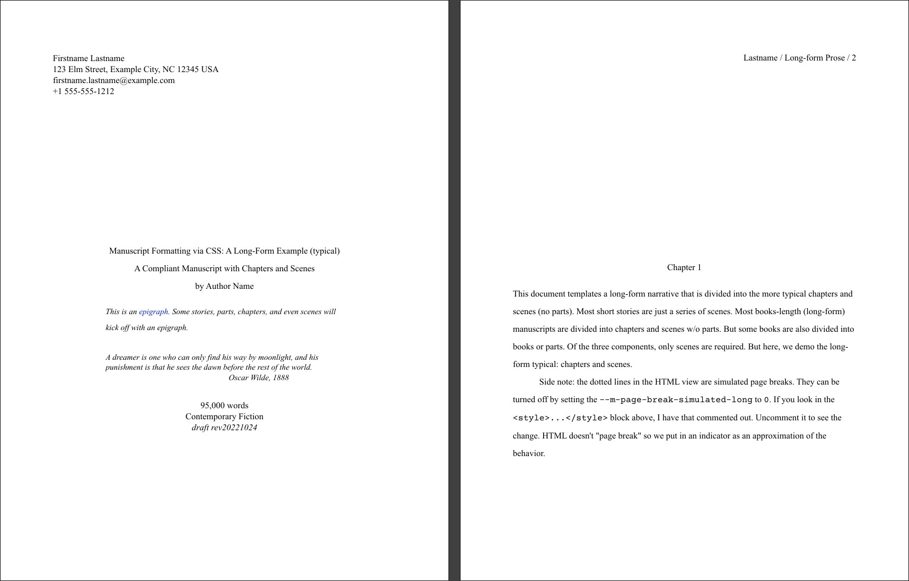

# Write your Manuscript in Markdown or HTML — for Creative Writers

Are you a writer? In particular, a writer of narrative works? Fiction,
narrative nonfiction, memoir, etc? Do prefer the simplicity of drafting you
work in a text or markdown editor? And do you wish to share your drafts in a
professional manner without having to port your work to a word processor?

Now, you can stay in your favorite text editor and still have a means to
present your work in a professional manner for review, critique, or whatever,
from working draft to finalized manuscript.

1. Copy one of the templates from the [templates](./templates) folder that best
   matches your project—novel, short story, or poems—to a new
   [markdown](https://www.markdownguide.org/) file. For example to
   "`mylastname-mystory.md`"
2. Draft your novel, story, or poetry in your favorite text editor.
3. Export your work to HTML or PDF/Print: "`mylastname-mystory.html`"
   or "`mylastname-mystory.pdf`"
4. Submit your work for review by friends, family, and your critique group with
   a work in industry standard
   [short story](https://format.ms/story),
   [novel](https://format.ms/novel), or [poetry](https://format.ms/poetry)
   manuscript format.
5. Submit your work to publishers who accept manuscripts in PDF format.  
   <small>Note: Some publishers (and nearly all traditional book publishers) insist on your work being submitted in `.docx` format. For that, use this process until you are absolutely ready to submit to such a publisher and then port the project to `.docx` using LibreOffice, Google Docs, or MS Word. More information on some of the techniques to do that are listed later in this document.</small>

<div class="newsbox">

>### NEWS - 2025-09-12 - Manuscript version 4.0 released
>
>- Automatically updated under the covers.
>- But … **breaking changes**.  
>  To use the older version, configure your markdown or html documents to use `manuscript-3.0.css` instead of `manuscript.css`.
>- What's new: (1) a major refactor and improvement across the board (much of which backported to 3.0), (2) **poetry manuscripts finally achieve compliance with the shunn.net manuscript spec**.

</div>

# Manuscript formatting?

Take a look at the PDFs in the [examples folder](./examples/) in this
repository. These manuscripts were rendered from their
corresponding markdown-formatted draft documents. No fluff and easy to read and
review. Here are some screenshots of the results . . .

<a href="examples/example-poe-the-tell-tale-heart.pdf"></a>
<a href="examples/example-lovecraft-at-the-mountains-of-madness.pdf"></a>

<div style="clear: both;"></div>

<a href="examples/example-prose-long.pdf"></a>

<div style="clear: both;"></div>

# What is NOT supported

### 1. This process is not for book production

A manuscript is not a formatted book. It's an industry standard format used to
share your work with other humans for review and comment, and to submit to
publishers.

To create a book for self-publishing, look into tools like
[Reedsy](https://reedsy.com/write-a-book), [Scribus](https://www.scribus.net/),
Vellum, InDesign, and Atticus.

### 2. This process does not easily produce a `.docx` document.

Many/most publishers require your manuscript to formatted as a Microsoft Word `.docx` file. (Word 2007 seems to be the most portable.)  Some publishers and agents, especially the better ones, will accept a `.pdf`, but most require `.docx`. There are ways to automate generating `.docx` files, but it's not a piece of cake and never does a good job. Read more about that in [README-structure-summary.md](README-structure-summary.md).

Also check out the myriad of authoring platforms out there: Scrivener, Novlr,
LivingWriter, Dabble, Ulysses, Storyist (Apple-only, blech!), Final Draft (for
screenwriters), Quoll Writer (Windows-only and not sure if Quoll Writer can
produce a manuscript), others. This project can do marvelous things with HTML:
<https://pagedjs.org/>. And if you are data-scientist, check out
<https://bookdown.org/>.


# What IS supported

Manuscript formatting similar to what many call Shunn Formatting:
  https://www.shunn.net/format/ (the "modern" formats)
- Prose manuscripts: short (scenes), long (chapters, scenes), narrative,
  nonnarrative
- Poetry manuscripts: single or many poem manuscripts
- US Letter, A4, and, though you shouldn't, A5, A6, US Half-letter
- If you are CSS savvy, easy-to-alter settings for nearly everything (fonts,
  margins, spacing, even the dinkuses and the -30- indicator).

### Recommended Editors and Tools

- Any text editor
    * Edit - any editor can be used to edit your manuscript
- [Joplin](https://joplinapp.com) - the (mostly) seamless experience
    * Edit
	+ Preview: renders an accurate preview of the manuscript
    * HTML: export to compliant HTML file
    * PDF: export to compliant PDF file
    * Recommended: install the *Import Local CSS* plugin so you can
      import the CSS from a webhost, or from your local harddrive
- [VSCodium](https://vscodium.com/), the open-source version of
  [VSCode](https://code.visualstudio.com/)
    * Edit
	+ Preview: renders an accurate preview of the manuscript
    * HTML: export to compliant HTML file
    * PDF: export to compliant HTML file …  
      - then export to compliant PDF using a Chromium-based browser  
        (Chrome, Vivaldi, Edge, Safari (desktop only), Opera, etc.)  
        *<small>NOTE: Firefox-based browsers CAN VIEW an the exported HTML
        document just fine, but it CANNOT render the PDF correctly because they
        cannot process @page rules correctly.</small>*
    * **Required:** install the *Markdown All-in-One* extension
    * **Limitations:** (1) you can't export to PDF directly within
      VSCodium/VSCode (not accurately), and (2) you MUST import manuscript.css
      from a webhost
- [Ghostwriter](https://ghostwriter.kde.org/) - love this editor
	+ Edit: has focus and Hemingway modes!
	+ Preview: renders an accurate preview of the manuscript
	+ HTML: export to compliant HTML file
    + Caveat: terrible syntax highlighting
- [Apostrophe](https://en.wikipedia.org/wiki/Apostrophe_(text_editor)) - Linux
  only
	+ Edit: has focus and Hemingway modes!
	+ Preview: renders an accurate preview of the manuscript
    * Caveat: the interface is quiry

### … tools:

- Chrome browser + [Markdown Viewer](https://chromewebstore.google.com/detail/markdown-viewer/ckkdlimhmcjmikdlpkmbgfkaikojcbjk) extension
    * Preview: render a preview of the manuscript, whether in markdown format
      or HTML.
    * PDF: convert your markdown document to PDF: `CTRL-P` in the browser
      (super simple).

- [Pandoc](https://pandoc.org/) - markdown to HTML command line tool
    * HTML: convert your saved markdown document to a compliant HTML document.
      From the commandline! :)
    * I only include this here for the folks who like to experiment.


### Editors and Tools to Specifically Avoid

Note, I have only tested maybe a dozen editors. These ones are particularly
painful to use, IMHO.

- [Obsidian](https://obsidian.md/) - A Joplin competitor, but without Joplin's
  functionality. Terrible at importing and exporting. Can't render anything
  correctly.
- [Atom](https://atom.io/) - DEAD PROJECT. Once, wildly-popular. Now
  unmaintained. VSCodium/VSCode replaces this editor's look and feel.
- [Marktext](https://github.com/marktext/marktext) - DEAD PROJECT. Once, a
  great, minimalistic writer's editor. Now unmaintained.
- [Firefox(https://www.firefox.com/en-US/) and derivatives, like [Zen](https://zen-browser.app/) and [LibreWolf](https://librewolf.net/) - Zen is actually my go-to browser, but the Firefox engine cannot render an accurate PDF for prose. (It works fine for poetry since the poetry manuscript rendering doesn't use @page margin headers.)


# TL;DR Just show me how to do it!

## First, download this repository

- Command line: copy (clone) the `git` repository:

  ```shell
  git clone https://github.com/taw00/manuscript-css/
  cd manuscript-css
  ```

- Via a browser:
  1. browse to <https://github.com/taw00/manuscript-css/>
  2. Click `Code` (big blue button) > `Download zip`
  4. Unzip the `manuscript-css-main.zip` file.
  5. Change that name to `manuscript-css` if you like.
  6. `cd manuscript-css`
  7. Recommend:  
     If you own a webserver somewhere, stick this repo in your `/pub/`
     directory so you can import it over the web. (Not a needed step if using
     Joplin as your editor.)

Check out the example manuscripts in this repository in their original markdown
and then as PDFs. Use one of the [templates](./templates/) as a template for
your own work. And if you are already familiar with converting markdown to HTML
and then HTML to PDF then that should be enough to get you going.


## Process summary - super high-level

**(1) Copy and rename** one of `.md` templates. **(2) Edit and replace** the
text with your contact information, your story, etc. **(3) Preview it** either
in-application or in a Chrome browser. Then **(4) export to PDF** using either
Joplin (the direct way) or a Chrome-based browser (Firefox cannot do this,
unfortunately).

### Step 1 - Copying from a template

Choose a template to from the `manuscript-css/templates/` folder. For your
first time, I recommend `prose-template-short-form.md`. Rename it to whatever
makes sense to you like `lastname-storytitle.md` which is a pretty standard
filename for a manuscript.

### Step 2 - Edit the markdown document

Use any editor: [Joplin](https://joplinapp.org),
[VSCodium](https://vscodium.com/), [Ghostwriter](https://ghostwriter.kde.org/),
[Apostrophe](https://en.wikipedia.org/wiki/Apostrophe_(text_editor)), [Zed
editor](https://zed.dev/), Xed, Vim, [Gnome Text
Editor](https://gitlab.gnome.org/GNOME/gnome-text-editor), even Notepad if you
like.

- Open that markdown document (`lastname-storytitle.md` in our example) in your
  favorite editor.
- Replace the templated content with yours
- Write your story, scene by scene. (Or if a poetry collection, poem by poem.)

### Step 3 - Preview the manuscript

- Method 1 - in-app: This can done natively with Joplin, VSCodium/VSCode, or
  Apostrophe
- Method 2 - in-browser: This is done using a Chrome-based browser and the
  *Markdown Viewer* extension. Or by viewing an exported HTML document with the
  browser.

### Step 4 - Export the manuscript to a PDF document

- Method 1 - [Joplin](https://joplinapp.org): CTRL-SHIFT-E
- Method 2 - [Markdown Viewer](https://chromewebstore.google.com/detail/markdown-viewer/ckkdlimhmcjmikdlpkmbgfkaikojcbjk) extension in Chrome: CTRL-P  
  (*The easiest way if not using Joplin.*)
- Method 3 - [VSCodium](https://vscodium.com/)/VSCode: export the HTML to your
  harddive, then use your browser (Chromium-based only!) to view it and "print
  to file."
- Method 4: [Pandoc](https://pandoc.org/): convert the markdown document to
  HTML, then use your browser (Chromium-based only!) to view it and "print to
  file."


## Notes about using some of the tools

### Joplin: markdown to exported PDF

*Edit, Preview, and then export a PDF, all in the same application interface.*

Install [Joplin](https://joplinapp.org), but then also install the *Import
Local CSS* plugin.

Joplin has a built-in previewer so you can see what the manuscript will look
like. When you are ready to produce a PDF, then press `CTRL-SHIFT-E` from
within the application.

**Notes**

- You can also export to HTML if you prefer that (right-click on the "note" and
  export to *HTML file*).
- If you subscribe to the [Joplin Cloud](https://joplincloud.com) service, you
  can share the document in a browser with friends and family and critique
  groups by just sending them a link to view.

**Extra Step for A4 and A5 page dimensions**

Joplin hijacks the page dimensions. If you want to output A4, for example, you
need to (a) set the A4 class value in your document like normal (read
[README-structure-summary.md](README-structure-summary.md) for more
information), and (b) set it in the Joplin UI: `Options` > `General` > `Show
Advanced Settings` and then set your preferred page size and orientation there.
Just make sure your document settings and your Joplin settings match.

Or … just export your document to an HTML file, view that with your browser and
`CTRL-P`.


### VSCodium/VSCode: markdown to exported HTML

*Edit, Preview, and, if you like, export to an HTML document.*

Install [VSCodium](https://vscodium.com/), but then also install
(`CTRL-SHIFT-X`) these extensions: `Markdown All-in-One`, and optionally
`Markdown Preview Mermaid Support`, `Markdown Footnotes`, and `Markdown
Superscript`. (The first extension is required.)

VSCodium has a built-in previewer (`CTRL-k` release then `v`) so you can see
what the manuscript will look like. To convert to a PDF document you have to
either export it to HTML then convert that to PDF with a Chrome-based browser
or Pandoc, or use the browser + the *Markdown Viewer* extension to view the
markdown document and convert that to a PDF document.

To export to HTML on disk:  `CTRL-SHIFT-P` and then `>Markdown All in One:
Print current document to HTML`. It will be saved, in the same directory as the
markdown document.

Of course, exporting to HTML is optional if your goal is a compliant PDF. If
that is the case, then use VSCodium just for editing and previewing and
*Markdown Viewer* + Chrome for creating the PDF.

> <small>**A BIG CAVEAT WITH VSCODIUM & VSCODE**  
> These editors block importing (`@import`) from the filesystem. If you want to
> use the previewer and renderer in VSCodium, you will have to host the
> `manuscript-css` folder on the web somewhere. Or in the meantime, as of this
> writing, just use my instance:
> ```markdown
> @import url("https://toddwarner.io/pub/css/manuscript-css/manuscript.css");
> ```
> That is not guaranteed to be a functional link forever though.</small>

**Side note**  
With Joplin, you can use its native editor, or any other editor. If you are
Joplin user but also love VSCodium, there is an excellent extension
`joplin-vscode-plugin` that enables it to plug into the Joplin application.
Other editors are simpler to use with Joplin, though. I personally use the [Zed
editor](https://zed.dev/).

### Ghostwriter: markdown to exported HTML

Out of the box, [Ghostwriter](https://ghostwriter.kde.org/) will not render a
correct preview of your work. You just need to adjust a couple settings so you
can preview correctly and export to HTML correctly.

- Configure Ghostwriter to preview correctly: Settings > Preview&nbsp;Options…
  > Markdown&nbsp;Flavor: `Pandoc CommonMark`
- To export to HTML file: `CTRL-E`
	+ Markdown&nbsp;Converter: `Pandoc CommonMark`
	+ File&nbsp;Format: `HTML 5`
	+ Command&nbsp;line&nbsp;options:
      `--metadata title="storytitle" --no-highlight -f markdown-native_divs+raw_html`  
      <small>(optional: the title in this configuration is only saved in the
      PDF metadata. If you want to change it for each story, feel free)</small>

Of course, exporting to HTML is optional if your goal is a compliant PDF. If
that is the case, then use Ghostwriter just for editing and previewing, and
*Markdown Viewer* + Chrome for creating the PDF from your completed Markdown
text file.

### Markdown Viewer browser extension: markdown document to PDF document

*Preview, and then when ready, export a PDF from a Markdown-formatted file.*

This enables you to use any text editor to work with your manuscript, and then
this browser extension to do the conversion.

First, in your Chrome-based browser (Chrome, Vivaldi, Edge, Safari on the
desktop, etc.), install the
[Markdown Viewer](https://chromewebstore.google.com/detail/markdown-viewer/ckkdlimhmcjmikdlpkmbgfkaikojcbjk)
extension.

Configure the extension:
- pin it to the top bar of the browser
- click on the M logo
- THEME: SIMPLE
- right click > Manage Extension: make sure *Allow access to file URLs* is
  turned on.

Then browse to your markdown file using your Chrome-based browser, open it, (or
use your file browser to browse to it and then open in Chrome) and it should be
rendered nicely as a manuscript-formatted document. Refresh the view as you
edit the document with your text editor, and then `CTRL-P` when you are ready
to export the document to PDF.

### Pandoc: markdown document to HTML document

**Most people will not use this option,** but I present it here for the geeks …

This requires you use the command line and to have Pandoc installed,
<https://pandoc.org/>.

Convert your markdown-formatted completed manuscript to HTML:  
(In this example really only `-V` and `--metadata` are optional.)

```plaintext
pandoc -s -V lang=en --no-highlight -f markdown-native_divs+raw_html \
  --metadata title="storytitle" \
  -o lastname.storytitle.html lastname.storytitle.md
```

- `-s` means standalone rendering
- `-V lang=en` inserts the correct locale info in the HTML head element.
  Change `en` to your locale.
- `--no-highlight` means to not do any syntax highlighting.
- `-f markdown-native_divs+raw_html` tells pandoc to trust our markup and not
  "autofix" certain things (that then break our markdown).
- `--metadata title="your title goes here"` sets the HTML title.
- `-o filename.html` sets the output filename

Then use the browser to open that HTML document and when ready, export to PDF
(`CTRL-P).

That's it! Congrats!

Questions? Comments? Post them in the Discussions section of this repository.  
-todd

---
---

# Other things

### What's completely untested

- Markdown-style Tables - I have done no work to make sure they look right in a
  manuscript. If this is something you would like to see … let me know. Also,
  give me examples of how it should look.
- I have also done no styling for images. If you want to add images to your
  document, you are on your own. For now. I'll probably play with that in the
  future.

### Porting your finished draft to LibreOffice and/or Google Docs (or any other
word processor)

**LibreOffice**

I have included Libreoffice templates in this repository. Copy the templates
into the `$HOME/Templates/` folder.  (Look in `Tools > Options, LibreOffice >
Paths` for your Templates folder location.)

You could use Pandoc to generate a functional, but messy LibreOffice `.odt`
document and then edit it until it is properly formatted. But … that document
will be MESSY.

```plaintext
pandoc -o your-manuscript.odt your-manuscript.md
```

Better, though tedious, is to create a fresh document in LibreOffice from one
of the templates I have provided. And then cut and paste text from the PDF you
generated using one of the methods above, adjusting the formatting as needed.
Not ideal, but it works and it goes faster than it sounds.

To create a nice clean fresh-from-a-template LibreOffice document:
- Open LibreOffice
- `File > New > Templates...` and pick the appropriate template.
- Here are some of my customizations. The templates are templated as such
  because they closely match Google Docs import/export style names. Looking at
  all the styles, everything under
    * "normal" represents everything in the document: "normal" is the text and
    * other random things.
    * "Heading 1" is for part titles.
    * "Heading 2" is for chapter titles.
    * "Heading 6" is for dinkus markers and the -30- marker. You
      will have to figure out how to wedge everything else in if
      you did a bunch of fancy things.
- cut-and-paste from that PDF (CTRL-SHIFT-V to make sure you paste without
  formatting) a bit at a time and then change the style for each paragraph and
  whatnot.

**Google Docs**

Check out my Google Docs templates
[here](https://drive.google.com/drive/folders/1VHZiNtNyCqU3BOJG7sGdywo_8Ag2DcUL).

You can get your document into Google Docs one of two ways: 1. port it to
LibreOffice, generate a .odt and then import that into Google Docs (I prefer
this method). Or 2. you could create a new clean document from one of those
templates and do the cut-and-paste shuffle as described earlier.

### My workflow as a writer:

1. **0-draft:** handwritten, with pen-and-ink, in a composition notebook
2. **work-in-progress:** transcribed to the Joplin desktop application
   interface (markdown)
3. **review by other:** I periodic share drafts or portion of a drafts with
   friends, family, and critique partners. For this, I also use Joplin's
   excellent Joplin Cloud service which has a really convenient
   publish-to-the-web feature.  But I will also have just print my work in
   progress (in manuscript form of course) and hand people a hardcopy to
   review.

4. **submission for publication:** If they accept a PDF, I just generate a PDF
   directly from Joplin and submit that. If they require a `.docx`, I port my
   markdown to PDF then to over to LibreOffice writer. It doesn't take that
   long.  Then do a final proofread, and then export and submit a `.docx` file
   and wait for the rejections. :)

### Is Todd a Joplin shill?

Nope. It's just the best application that I have found for this kind of work.

The great majority of markdown editors are great at editing text. Some can also
preview your work (most cannot). Joplin is, I think, the only text editor with
full CSS rendering capability and that can also export to HTML or PDF natively.

<a href="misc/README-joplin.png"></a>


The [Joplin](https://joplinapp.org) note-taking application (like Obsidian but
much better) gives you the full ability to customize the results of whatever
you write to your hearts content using standard CSS. Joplin is also a great
personal document-management platform (like Evernote, but better). And it can
sync to the cloud. And you can publish things to the cloud for anyone to view.
And it is fully end-to-end encrypted. And it has a web-clipper (super handy!!!)
and a mobile app. And, and! So, yes, I suppose I am a Joplin shill. But for all
the right reasons.

But I also use other editors out there—primarily Zed, Ghostwriter, and Vim. I
am sure you have your preferred interface. To work with any other edit, just
install Chrome and the *Markdown Viewer* extension and follow the steps above.
It's not complicated.

---
---

# Addendum: manuscript format guidelines

### Novels

- <https://www.shunn.net/format/novel/>
- <https://graemeshimmin.com/manuscript-format-for-novel-submission/> A4!
- <https://blog.reedsy.com/guide/book-manuscript-format/>

### Novellas

- <https://www.shunn.net/format/2009/03/proper_novella_format.html>

### Short Narratives

- <https://www.shunn.net/format/story/>

### Poetry

- <https://www.shunn.net/format/poetry/>
- <https://www.masterclass.com/articles/how-to-format-and-submit-your-poetry-manuscript>

---

# Good luck!

Check out the [example manuscripts](templates/) in this repository and I think
how everything works with `manuscript.css` becomes obvious.

Good luck. Now, quit fooling around on the internet and write something.

Copyright (c) Todd Warner <t0dd@protonmail.com>  
This work is licensed under Attribution 4.0 International. To view a copy of
this license, visit <http://creativecommons.org/licenses/by/4.0/>.
