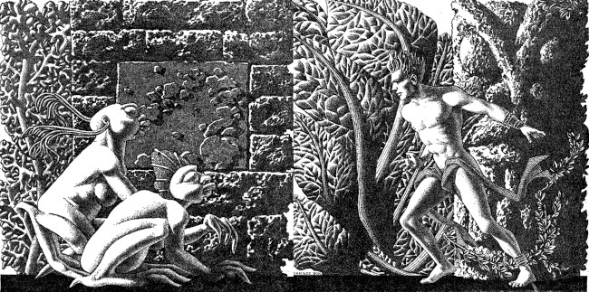

<article id="manuscript" class="long narrative">

[comment]:: "-------------------------- TITLE PAGE ---------------------------"

Howard Phillips Lovecraft

65 Prospect Street

Providence, RI 02906

401.555.1212

crawlingchaos\@example\.com

17,000 Words

# The Shadow Over Innsmouth

## Horrifying Novelette

### by H.P. Lovecraft

> Unspeakable monstrousness over-hung the crumbling, stench-cursed town of 
> Innsmouth ... and folks there had somehow got out of the idea of dying....
>
> This text was adapted from a transcription found on the
> [Project Gutenburg](https://gutenberg.org/ebooks/73181). This etext was
> produced from Weird Tales January 1942.

[comment]: / "---------------------- CHAPTER & SCENES ------------------------"

<section class="chapter">

# I

<section class="scene">

During the winter of 1927-28 Federal government officials made a strange and secret investigation of certain conditions in the ancient Massachusetts seaport of Innsmouth. The public first learned of it in February, when a vast series of raids and arrests occurred, followed by the deliberate burning and dynamiting—under suitable precautions—of an enormous number of crumbling, worm-eaten, and supposedly empty houses along the abandoned waterfront. Uninquiring souls let this occurrence pass as one of the major clashes in a spasmodic war on liquor.

Keener news-followers, however, wondered at the prodigious number of arrests, the abnormally large force of men used in making them, and the secrecy surrounding the disposal of the prisoners. No trials, or even definite charges, were reported; nor were any of the captives seen thereafter in the regular jails of the nation. There were vague statements about disease and concentration camps, and later about dispersal in various naval and military prisons, but nothing positive ever developed.

Complaints from many liberal organizations were met with long confidential discussions, and representatives were taken on trips to certain camps and prisons. As a result, these societies became surprisingly passive and reticent. Newspaper men were harder to manage, but seemed largely to cooperate with the government in the end. Only one paper—a tabloid always discounted because of its wild policy—mentioned the deep-diving submarine that discharged torpedoes downward in the marine abyss just beyond Devil Reef. That item, gathered by chance in a haunt of sailors, seemed indeed rather far-fetched; since the low, black reef lies a full mile and a half out from Innsmouth Harbor.

But at last I am going to defy the ban on speech about this thing. Results, I am certain, are so thorough that no public harm save a shock of repulsion could ever accrue from a hinting of what was found by those horrified raiders at Innsmouth. For my contact with this affair has been closer than that of any other layman, and I have carried away impressions which are yet to drive me to drastic measures.

It was I who fled frantically out of Innsmouth in the early morning hours of July 16, 1927, and whose frightened appeals for government inquiry and action brought on the whole reported episode. I was willing enough to stay mute while the affair was fresh and uncertain; but now that it is an old story, with public interest and curiosity gone, I have an odd craving to whisper about those few frightful hours in that ill-rumored and evilly-shadowed seaport of death and blasphemous abnormality.

I never heard of Innsmouth till the day before I saw it for the first and—so far—last time. I was celebrating my coming of age by a tour of New England—sightseeing, antiquarian, and genealogical—and had planned to go directly from ancient Newburyport to Arkham, whence my mother's family was derived. I had no car, but was traveling by train, trolley, and motor-coach, always seeking the cheapest possible route. In Newburyport they told me that the steam train was the thing to take to Arkham; and it was only at the station ticket-office, when I demurred at the high fare, that I learned about Innsmouth. The stout, shrewd-faced agent, whose speech showed him to be no local man, seemed sympathetic toward my efforts at economy, and made a suggestion that none of my other informants had offered.

"You could take that old bus, I suppose," he said with a certain hesitation, "but it ain't thought much of hereabouts. It goes through Innsmouth—you may have heard about that—and so the people don't like it. Run by an Innsmouth fellow—Joe Sargent—but never gets any custom from here, or Arkham either, I guess. Leaves the Square—front of Hammond's Drug Store—at 10 A.M. and 7 P.M. unless they've changed lately. Looks like a terrible rattletrap—I've never been on it."

That was the first I ever heard of shadowed Innsmouth. Any reference to a town not shown on common maps or listed in recent guidebooks would have interested me, and the agent's old manner of allusion roused something like real curiosity. So I asked the agent to tell me something about it.

He was very deliberate, and spoke with an air of feeling slightly superior to what he said.

"Innsmouth? Well, it's a queer kind of town down at the mouth of the Manuxet. Used to be almost a city—quite a port before the War of 1812—but all gone to pieces in the last hundred years or so. No railroad now—B. & M. never went through, and the branch line from Rowley was given up years ago.

"More empty houses than there are people, I guess, and no business to speak of except fishing and lobstering. Everybody trades mostly either here or in Arkham or Ipswich. Once they had quite a few mills, but nothing's left now except one gold refinery running on the leanest kind of part time.

"That refinery, though, used to be a big thing, and Old Man Marsh, who owns it, must be richer'n Croesus. Queer old duck, though, and sticks mighty close in his home. He's supposed to have developed some skin disease or deformity late in life that makes him keep out of sight. Grandson of Captain Obed Marsh, who founded the business. His mother seems to've been some kind of foreigner—they say a South Sea islander—so everybody raised Cain when he married an Ipswich girl fifty years ago. They always do that about Innsmouth people, and folks here and hereabouts always try to cover up any Innsmouth blood they have in 'em. But Marsh's children and grandchildren look just like anybody else so far's I can see. I've had 'em pointed out to me here—though, come to think of it, the elder children don't seem to be around lately. Never saw the old man.

"And why is everybody so down on Innsmouth? Well, young fellow, you mustn't take too much stock in what people around here say. They're hard to get started, but once they do get started they never let up. They've been telling things about Innsmouth—whispering 'em, mostly—for the last hundred years, I guess, and I gather they're more scared than anything else. Some of the stories would make you laugh—about old Captain Marsh driving bargains with the devil and bringing imps out of hell to live in Innsmouth, or about some kind of devil-worship and awful sacrifices in some place near the wharves that people stumbled on around 1845 or there-abouts—but I come from Panton, Vermont, and that kind of story don't go down with me.

"You ought to hear, though, what some of the old-timers tell about the black reef off the coast—Devil Reef, they call it. It's well above water a good part of the time, and never much below it, but at that you could hardly call it an island. The story is that there's a whole legion of devils seen sometimes on that reef—sprawled about, or darting in and out of some kind of caves near the top. It's a rugged, uneven thing, a good bit over a mile out, and toward the end of shipping days sailors used to make big detours just to avoid it.

"That is, sailors that didn't hail from Innsmouth. One of the things they had against old Captain Marsh was that he was supposed to land on it sometimes at night when the tide was right. Maybe he did, for I dare say the rock formation was interesting, and it's just barely possible he was looking for pirate loot and maybe finding it; but there was talk of his dealing with demons there. Fact is, I guess on the whole it was really the captain that gave the bad reputation to the reef.

"That was before the big epidemic of 1846, when over half the folks in Innsmouth was carried off. They never did quite figure out what the trouble was, but it was probably some foreign kind of disease brought from China or somewhere by the shipping. It surely was bad enough—there was riots over it, and all sorts of ghastly doings that I don't believe ever got outside of town—and it left the place in awful shape. Never came back—there can't be more'n 300 or 400 people living there now.

"But the real thing behind the way folks feel is simply race prejudice—and I don't say I'm blaming those that hold it. I hate those Innsmouth folks myself, and I wouldn't care to go to their town. I s'pose you know—though I can see you're a Westerner by your talk—what a lot our New England ships used to have to do with queer ports in Africa, Asia, the South Seas, and everywhere else, and what queer kinds of people they sometimes brought back with 'em. You've probably heard about the Salem man that came home with a Chinese wife, and maybe you know there's still a bunch of Fiji Islanders somewhere around Cape Cod.

"Well, there must be something like that back of the Innsmouth people. The place always was badly cut off from the rest of the country by marshes and creeks, and we can't be sure about the ins and outs of the matter; but it's pretty clear that old Captain Marsh must have brought home some odd specimens when he had all three of his ships in commission back in the twenties and thirties. There certainly is a strange kind of a streak in the Innsmouth folks today—I don't know how to explain it, but it sort of makes you crawl. You'll notice a little in Sargent if you take his bus. Some of 'em have queer narrow heads with flat noses and bulgy, starey eyes that never seem to shut, and their skin ain't quite right. Rough and scabby, and the sides of their necks are all shriveled or creased up. Get bald, too, very young. The older fellows look the worst—fact is, I don't believe I've ever seen a very old chap of that kind. Guess they must die of looking in the glass! Animals hate 'em—they used to have lots of horse trouble before autos came in.

"Nobody can ever keep track of those people, and state school officials and census men have a devil of a time. You can bet that prying strangers ain't welcome around Innsmouth. I've heard personally of more'n one business or government man that's disappeared there, and there's loose talk of one who went crazy and is out at Danvers now. They must have fixed up some awful scare for that fellow.

"That's why I wouldn't go at night if I was you. I've never been there and have no wish to go, but I guess a daytime trip couldn't hurt you—even though the people hereabouts will advise you not to make it. If you're just sightseeing, and looking for old-time stuff, Innsmouth ought to be quite a place for you."

And so I spent part of that evening at the Newburyport Public Library looking up data about Innsmouth. The Essex County histories on the library shelves had very little to say, except that the town was founded in 1643, noted for shipbuilding before the Revolution, a seat of great marine prosperity in the early 19th century, and later a minor factory center using the Manuxet as power. The epidemic and riots of 1846 were very sparsely treated, as if they formed a discredit to the country.

References to decline were few, though the significance of the later record was unmistakable. After the Civil War all industrial life was confined to the Marsh Refining Company, and the marketing of gold ingots formed the only remaining bit of major commerce aside from the eternal fishing.

Most interesting of all was a glancing reference to the strange jewelry vaguely associated with Innsmouth. It had evidently impressed the whole countryside more than a little, for mention was made of specimens in the museum of Miskatonic University at Arkham, and in the display room of the Newburyport Historical Society. I resolved to see the local sample—said to be a large, queerly-proportioned thing evidently meant for a tiara—if it could possibly be arranged.

The librarian gave me a note of introduction to the curator of the Society, a Miss Anna Tilton, who lived nearby, and after a brief explanation that ancient gentlewoman was kind enough to pilot me into the closed building, since the hour was not outrageously late. The collection was a notable one indeed, but in my present mood I had eyes for nothing but the bizarre object which glistened in a corner cupboard under the electric lights.

It took no excessive sensitiveness to beauty to make me literally gasp at the strange, unearthly splendor of the alien, opulent phantasy that rested there on a purple velvet cushion. The longer I looked, the more the thing fascinated me; and in this fascination there was a curiously disturbing element hardly to be classified or accounted for. I decided that it was the queer other-worldly quality of the art which made me uneasy. It was as if the workmanship were that of another planet.

The patterns all hinted of remote secrets and unimaginable abysses in time and space, and the monotonously aquatic nature of the reliefs became almost sinister. Among these reliefs were fabulous monsters of abhorrent grotesqueness and malignity—wholly primal and awesomely ancestral.

At times I fancied that every contour of these blasphemous fish-frogs was overflowing with the ultimate quintessence of unknown and inhuman evil.

In odd contrast to the tiara's aspect was its brief and prosy history as related by Miss Tilton. It had been pawned for a ridiculous sum at a shop in State Street in 1873, by a drunken Innsmouth man shortly afterward killed in a brawl.

Miss Tilton was inclined to believe that it formed part of some exotic pirate hoard discovered by old Captain Obed Marsh. This view was surely not weakened by the insistent offers of purchase at a high price which the Marshes began to make as soon as they knew of its presence, and which they repeated to this day despite the Society's unvarying determination not to sell.

As the good lady showed me out of the building, she assured me that the rumors of devil-worship were partly justified by a peculiar secret cult which had gained force there and engulfed all the orthodox churches.

It was called, she said, "The Esoteric Order of Dagon," and was undoubtedly a debased, quasi-pagan thing imported from the East a century before, at a time when Innsmouth fisheries seemed to be going barren. Its persistence among a simple people was quite natural in view of the sudden and permanent return of abundantly fine fishing, and it soon came to be the greatest influence on the town.

All this, to the pious Miss Tilton, formed an excellent reason for shunning the ancient town of decay and desolation; but to me it was merely a fresh incentive; and I could scarcely sleep in my small room at the "Y" as the night wore away.

</section></section>

[comment]: / "---------------------- CHAPTER & SCENES ------------------------"

<section class="chapter">

# II

<section class="scene">

Shortly before ten the next morning I stood with my one small valise in front of Hammond's Drug Store in old Market Square waiting for the Innsmouth bus. In a few moments a small motor-coach of extreme decrepitude and dirty gray color rattled down State Street, made a turn, and drew up at the curb beside me. I felt immediately that it was the right one; a guess which the half-illegible sign on the windshield—"Arkham-Innsmouth-Newb'port"—soon verified.

There were only three passengers—dark, unkempt men of sullen visage and somewhat youthful cast—and when the vehicle stopped they clumsily shambled out and began walking up State Street in a silent, almost furtive fashion. The driver also alighted. This, I reflected, must be the Joe Sargent mentioned by the ticket-agent; and even before I had noticed any details there spread over me a wave of spontaneous aversion which could be neither checked nor explained.

He was a thin, stoop-shouldered man not much under six feet tall, dressed in shabby blue civilian clothes and wearing a frayed gray golf cap. His age was perhaps thirty-five, but the odd, deep creases in the sides of his neck made him seem older when one did not study his dull, expressionless face. He had a narrow head, bulging, watery blue eyes that seemed never to wink, a flat nose, a receding forehead and chin, and singularly undeveloped ears. As he walked toward the bus I observed his peculiarly shambling gait and saw that his feet were inordinately immense. The more I studied them the more I wondered how he could buy any shoes to fit them.

A certain greasiness about the fellow increased my dislike. He was evidently given to working or lounging around the fish docks, and carried with him much of their characteristic smell. Just what foreign blood was in him I could not even guess.

I was sorry when I saw that there would be no other passengers on the bus. Somehow I did not like the idea of riding alone with this driver. But as the leaving time obviously approached I conquered my qualms and followed the man aboard, extending him a dollar bill and murmuring the single word "Innsmouth."

At length the decrepit vehicle started with a jerk, and rattled noisily past the old brick buildings of State Street amidst a cloud of vapor from the exhaust.

The day was warm and sunny, but the landscape of sand, sedge-grass, and stunted shrubbery became more and more desolate as we proceeded. Out the window I could see the blue water and the sandy line of Plum Island, and we presently drew very near the beach as our narrow road veered off from the main highway to Rowley and Ipswich.

At last we lost sight of Plum Island and saw the vast expanse of the open Atlantic on our left. Our narrow course began to climb steeply, and I felt a singular sense of disquiet in looking at the lonely crest ahead where the rutted roadway met the sky. It was as if the bus were about to keep on its ascent leaving the sane earth altogether and merging with the unknown arcana of upper air and cryptical sky. The smell of the sea took on ominous implications, and the silent driver's bent, rigid back and narrow head became more and more hateful. As I looked at him I saw that the back of his head was almost as hairless as his face, having only a few straggling yellow strands upon a gray scabrous surface.

Then we reached the crest and beheld the outspread valley beyond, where the Manuxet joins the sea just north of the long line of cliffs that culminate in Kingsport Head; all my attention was captured by the nearer panorama just below me. I had, I realized, come face to face with rumor-shadowed Innsmouth.

It was a town of wide extent and dense construction, yet one with a portentous dearth of visible life. The vast huddle of sagging gambrel roofs and peaked gables conveyed with offensive clearness the idea of wormy decay, and as we approached along the now descending road I could see that many roofs had wholly caved in. Stretching inland I saw the rusted, grass-grown line of the abandoned railway, with leaning telegraph-poles now devoid of wires.

Here and there the ruins of wharves jutted out from the shore to end in indeterminate rottenness, those farthest south seeming the most decayed. And far out at sea, despite a high tide, I glimpsed a long, black line scarcely rising above the water yet carrying a suggestion of odd latent malignancy. This, I knew, must be Devil Reef. As I looked, a subtle, curious sense of beckoning seemed superadded to the grim repulsion; and oddly enough, I found this overtone more disturbing than the primary impression.

As the bus reached a lower level I began to catch the steady note of a waterfall through the unnatural stillness. The leaning, unpainted houses grew thicker, lined both sides of the road, and displayed more urban tendencies than did those we were leaving behind. The panorama ahead had contracted to a street scene, and in spots I could see where a cobblestone pavement and stretches of brick sidewalk had formerly existed. All the houses were apparently deserted, and there were occasional gaps where tumbledown chimneys and cellar walls told of buildings that had collapsed. Pervading everything was the most nauseous fishy odor imaginable.

And I was not to reach my destination without one other very strong impression of poignantly disagreeable quality. The bus had come to a sort of open concourse or radial point with churches on two sides and the bedraggled remains of a circular green in the center, and I was looking at a large pillared hall on the right-hand junction ahead. The structure's once white paint was now gray and peeling, and the black and gold sign on the pediment was so faded that I could only with difficulty make out the words "Esoteric Order of Dagon."

The door of the church basement was open, revealing a rectangle of blackness inside. And as I looked, a certain object crossed or seemed to cross that dark rectangle; burning into my brain a momentary conception of nightmare which was all the more maddening because analysis could not show a single nightmarish quality in it.

It was a living object—the first except the driver that I had seen since entering the compact part of the town—and had I been in a steadier mood I would have found nothing whatever of terror in it. Clearly, as I realized a moment later, it was the pastor; clad in some peculiar vestments doubtless introduced since the Order of Dagon had modified the ritual of the local churches. The thing which had probably caught my first subconscious glance and supplied the touch of bizarre horror was the tall tiara he wore; an almost exact duplicate of the one Miss Tilton had shown me the previous evening. This, acting on my imagination, had supplied namelessly sinister qualities to the indeterminate face and robed, shambling form beneath it.

A very thin sprinkling of repellent-looking youngish people now became visible on the sidewalks—lone individuals, and silent knots of two or three. The lower floors of the crumbling houses sometimes harbored small shops with dingy signs, and I noticed a parked truck or two as we rattled along. The sound of waterfalls became more and more distinct, and presently I saw a fairly deep river-gorge ahead, spanned by a wide, iron-railed highway bridge beyond which a large square opened out. Then we rolled into the large semicircular square across the river and drew up on the right-hand side in front of a tall, cupola-crowned building with remnants of yellow paint and with a half-effaced sign proclaiming it to be the Gilman House.

I was glad to get out of that bus, and at once proceeded to check my valise in the shabby hotel lobby. There was only one person in sight—an elderly man without what I had come to call the "Innsmouth look"—and I decided not to ask him any of the questions which bothered me; remembering that odd things had been noticed in this hotel. Instead, I strolled out on the square, from which the bus had already gone, and studied the scene minutely and appraisingly.

For some reason or other I chose to make my first inquiries at the chain grocery, whose personnel was not likely to be native to Innsmouth. I found a solitary boy of about seventeen in charge, and was pleased to note the brightness and affability which promised cheerful information. He seemed exceptionally eager to talk, and I soon gathered that he did not like the place, its fishy smell, or its furtive people. His family did not like him to work in Innsmouth, but the chain had transferred him there and he did not wish to give up his job.

There was, he said, no public library or chamber of commerce in Innsmouth, but I could probably find my way about. The street I had come down was Federal. West of that were the fine old residence streets—Broad, Washington, Lafayette, and Adams—and east of it were the shoreward slums.

Certain spots were almost forbidden territory, as he had learned at considerable cost. One must not, for example, linger much around the Marsh refinery, or around any of the still used churches, or around the pillared Order of Dagon Hall at New Church Green. Those churches were very odd—all violently disavowed by their respective denominations elsewhere, and apparently using the queerest kind of ceremonials and clerical vestments.

As for the Innsmouth people—the youth hardly knew what to make of them. Their appearance—especially those staring, unwinking eyes which one never saw shut—was certainly shocking enough—and their voices were disgusting. It was awful to hear them chanting in their churches at night, and especially during their main festivals or revivals, which fell twice a year on April 30 and October 31.

They were very fond of the water, and swam a great deal in both river and harbor. Swimming races out to Devil Reef were very common, and everyone in sight seemed well able to share in this arduous sport.

It would be of no use, my informant said, to ask the natives anything about the place. The only one who would talk was a very aged but normal-looking man who lived at the poorhouse on the north rim of the town and spent his time walking about or lounging around the fire station. This hoary character, Zadok Allen, was 96 years old and somewhat touched in the head, besides being the town drunkard. He was a strange, furtive creature who constantly looked over his shoulder as if afraid of something, and when sober could not be persuaded to talk at all with strangers. He was, however, unable to resist any offer of his favorite poison; and once drunk would furnish the most astonishing fragments of whispered reminiscence.

After all, though, little useful data could be gained from him; since his stories were all insane, incomplete hints of impossible marvels and horrors which could have no source save in his own distorted fancy. Nobody ever believed him, but the natives did not like him to drink and talk with any strangers; and it was not always safe to be seen questioning him. It was probably from him that some of the wildest popular whispers and delusions were derived.

The Marshes, together with the other three gently bred families of the town—the Waites, the Gilmans, and the Eliots—were all very retiring. They lived in immense houses along Washington Street, and several were reputed to harbor in concealment certain kinsfolk whose personal aspect forbade public view, and whose deaths had been reported and recorded.

Warning me that most of the street signs were down, the youth drew for my benefit a rough but ample and painstaking sketch map of the town's salient features. After a moment's study I felt sure that it would be of great help, and pocketed it with profuse thanks.

Thus began my systematic though half-bewildered tour of Innsmouth's narrow, shadow-blighted ways. Crossing the bridge and turning toward the roar of the lower falls, I passed close to the Marsh refinery, which seemed oddly free from the noise of industry. This building stood on the steep river bluff near a bridge and an open confluence of streets which I took to be the earliest civic center, displaced after the Revolution by the present Town Square.

Re-crossing the gorge on the Main Street bridge, I struck a region of utter desertion which somehow made me shudder. Collapsing huddles of gambrel roofs formed a jagged and fantastic skyline, above which rose the ghoulish, decapitated steeple of an ancient church.

Fish Street was as deserted as Main, though it differed in having many brick and stone warehouses still in excellent shape. Water Street was almost its duplicate, save that there were great seaward gaps where wharves had been. Not a living thing did I see, except for the scattered fishermen on the distant breakwater, and not a sound did I hear save the lapping of the harbor tides and the roar of the falls in the Manuxet.

I kept north along Main to Martin, then turning inland, crossing Federal Street safely north of the Green, and entering the decayed patrician neighborhood of northern Broad, Washington, Lafayette, and Adams Streets. Following Washington Street toward the river, I now faced a zone of former industry and commerce; noting the ruins of a factory ahead, and seeing others, with the traces of an old railway station and covered railway bridge beyond up the gorge on my right.

The uncertain bridge now before me was posted with a warning sign, but I took the risk and crossed again to the south bank where traces of life reappeared. Furtive, shambling creatures stared cryptically in my direction, and more normal faces eyed me coldly and curiously. Innsmouth was rapidly becoming intolerable, and I turned down Paine Street toward the Square in the hope of getting some vehicle to take me to Arkham before the still-distant starting time of that sinister bus.

It was then that I saw the tumbledown fire station on my left, and noticed the red-faced, bushy-bearded, watery-eyed old man in nondescript rags who sat on a bench in front of it talking with a pair of unkempt but not abnormal-looking firemen. This, of course, must be Zadok Allen, the half-crazed, liquorish non-agenarian whose tales of old Innsmouth and its shadow were so hideous and incredible.

</section></section>

[comment]: / "---------------------- CHAPTER & SCENES ------------------------"

<section class="chapter">

# III

<section class="scene">

I had been assured that the old man could do nothing but hint at wild, disjointed, and incredible legends, and I had been warned that the natives made it unsafe to be seen talking with him; yet the thought of this aged witness to the town's decay, with memories going back to the early days of ships and factories, was a lure that no amount of reason could make me resist. Curiosity flared up beyond sense and caution, and in my youthful egotism I fancied I might be able to sift a nucleus of real history from the confused, extravagant outpouring I would probably extract with the aid of whiskey.

A quart bottle of such was easily, though not cheaply, obtained in the rear of a dingy variety-store just off the Square in Eliot Street.

Re-entering the Square I saw that luck was with me; for—shuffling out of Paine Street around the corner of the Gilman House—I glimpsed nothing less than the tall, lean, tattered form of old Zadok Allen himself. In accordance with my plan, I attracted his attention by brandishing my newly-purchased bottle; and soon realized that he had begun to shuffle wistfully after me as I turned into Waite Street on my way to the most deserted region I could think of. Before I reached Main Street I could hear a faint and wheezy "Hey, Mister!" behind me, and I presently allowed the old man to catch up and take copious pulls from the quart bottle.

I began putting out feelers as we walked along to Water Street and turned southward amidst the omnipresent desolation and crazily tilted ruins, but found that the aged tongue did not loosen as quickly as I had expected. At length I saw a grass-grown opening toward the sea between crumbling brick walls, with the weedy length of an earth-and-masonry wharf projecting beyond. Piles of moss-covered stones near the water promised tolerable seats, and the scene was sheltered from all possible view by a ruined warehouse on the north.

About four hours remained for conversation if I were to catch the eight o'clock coach for Arkham, and I began to dole out more liquor to the ancient tippler; meanwhile eating my own frugal lunch. In my donations I was careful not to overshoot the mark, for I did not wish Zadok's vinous garrulousness to pass into a stupor. After an hour his furtive taciturnity showed signs of disappearing, and something or other had caused his wandering gaze to light on the low, distant line of Devil Reef, then showing plainly and almost fascinatingly above the waves. He bent toward me, took hold of my coat lapel, and hissed out some hints that could not be mistaken.

"Thar's whar it all begun—that cursed place of all wickedness whar the deep water starts. Gate o' hell—sheer drop daown to a bottom no saoundin'-line kin tech. Ol' Cap'n Obed done it—him that faound aout more'n was good fer him in the Saouth Sea islands.

"Never was nobody like Cap'n Obed—old limb o' Satan! Heh, heh! I kin mind him a-tellin' abaout furren parts, an' callin' all the folks stupid fer goin' to Christian meetin' an' bearin' their burdens meek an' lowly. Says they'd orter git better gods like some o' the folks in the Injies—gods as ud bring 'em good fishin' in return fer their sacrifices, an' ud reely answer folks's prayers.

"Matt Eliot, his fust mate, talked a lot, too, only he was agin' folks's doin' any heathen things. Told abaout an island east of Othaheite whar they was a lot o' stone ruins older'n anybody knew anything abaout, kind o' like them on Ponape, in the Carolines, but with carvin's of faces that looked like the big statues on Easter Island. They was a little volcanic island near thar, too, whar they was other ruins with diff'rent carvin's—ruins all wore away like they'd ben under the sea onct, an' with picters of awful monsters all over 'em.

"Wal, Sir, Matt he says the natives araound thar had all the fish they cud ketch, an' sported bracelets an' armlets an' head rigs made aout of a queer kind o' gold an' covered with picters o' monsters jest like the ones carved over the ruins on the little island—sorter fishlike frogs or froglike fishes that was drawed in all kinds o' positions like they was human bein's. Nobody cud git aout o' them whar they got all the stuff, an' all the other natives wondered haow they managed to find fish in plenty even when the very next islands had lean pickin's. Matt he got to wonderin' too, an' so did Cap'n Obed. Obed, he notices, besides, that lots of the han'some young folks ud drop aout o' sight fer good from year to year, an' that they wan't many old folk araound. Also, he thinks some of the folks looks durned queer even fer Kanakys.

"It took Obed to git the truth aout o' them heathens. I dun't know haow he done it, but he begun by tradin' fer the gold-like things they wore. Ast 'em whar they come from, an' ef they cud git more, an' finally wormed the story aout o' the old chief—Walakea, they called him. Nobody but Obed ud ever a believed the old yeller devil, but the Cap'n cud read folks like they was books. Heh, heh! Nobody never believes me naow when I tell 'em, an I dun't s'pose you will, young feller—though come to look at ye, ye hev kind o' got them sharp-readin' eyes like Obed had."

The old man's whisper grew fainter, and I found myself shuddering at the terrible and sincere portentousness of his intonation, even though I knew his tale could be nothing but drunken phantasy.

"Wal, Sir, Obed he larnt that they's things on this arth as most folks never heard abaout—an' wouldn't believe ef they did hear. It seems these Kanakys was sacrificin' heaps o' their young men an' maidens to some kind o' god-things that lived under the sea, an' gittin' all kinds o' favors in return. They met the things on the little islet with the queer ruins, an' it seems them awful picters o' frog-fish monsters was supposed to be picters o' these things. Mebbe they was the kind o' critters as got all the mermaids stories an' sech started. They had all kinds o' cities on the sea-bottom, an' this island was heaved up from thar. Seems they was some of the things alive in the stone buildin's when the island come up sudden to the surface. That's haow the Kanakys got wind they was daown thar. Made sign-talk as soon as they got over bein' skeert, an' pieced up a bargain afore long.

"Them things liked human sacrifices. Had had 'em ages afore, but lost track o' the upper world arter a time. What they done to the victims it ain't fer me to say, an' I guess Obed wa'n't none too sharp abaout askin'. But it was all right with the heathens, because they'd ben havin' a hard time an' was desp'rate abaout everything. They give a sarten number o' young folks to the sea-things twict every year—May-Eve an' Hallowe'en—reg'lar as cud be. Also give some o' the carved knick-knacks they made. What the things agreed to give in return was a plenty o' fish—they druv 'em in from all over the sea—an' a few gold-like things naow an' then.

"When it come to matin' with them toad-lookin' fishes, the Kanakys kind o' balked, but finally they larnt something as put a new face on the matter. Seems that human folks has got a kind o' relation to sech water-beasts—that everything alive come aout o' the water onct, an' only needs a little change to go back agin. Them things told the Kanakys that ef they mixed bloods there'd be children as ud look human at fust, but later turn more'n more like the things, till finally they'd take to the water an' jine the main lot o' things daown thar. An' this is the important part, young feller—them as turned into fish things an' went into the water wouldn't never die. Them things never died excep' they was kilt violent.

"Wal, Sir, it seems by the time Obed knowed them islanders they was all full o' fish blood from them deep-water things. When they got old an' begun to show it, they was kep' hid until they felt like takin' to the water an' quittin' the place. Some was more teched than others, an' some never did change quite enough to take to the water; but mostly they turned aout jest the way them things said. Them as was born more like the things changed arly, but them as was nearly human sometimes stayed on the island till they was past seventy, though they'd usually go daown under fer trial trips afore that. Folks as had took to the water, gen'rally come back a good deal to visit, so's a man ud often be a-talkin' to his own five-times-great-grandfather, who'd left the dry land a couple o' hundred years or so afore.

"Everybody got aout o' the idee o' dyin'—excep' in canoe wars with the other islanders, or as sacrifices to the sea-gods daown below, or from snake-bite or plague or sharp gallopin' ailments or somethin' afore they cud take to the water—but simply looked forrad to a kind o' change that wa'n't a bit horrible arter a while. They thought what they'd got was well wuth all they'd had to give up—an' I guess Obed kind o' come to think the same hisself when he'd chewed over old Walakea's story a bit. Walakea, though, was one of the few as hadn't got none of the fish blood—bein' of a royal line that intermarried with royal lines on other islands.

"Walakea give him a funny kind o' thingumajig made aout o' lead or something, that he said ud bring up the fish things from any place in the water whar they might be a nest of 'em. The idee was to drop it daown with the right kind o' prayers an' sech. Walakea allaowed as was the things was scattered all over the world, so's anybody that looked abaout cud find a nest an' bring 'em up ef they was wanted.

"Matt he didn't like this business at all, an' wanted Obed shud keep away from the island; but the Cap'n was sharp fer gain, an' faound he cud git them gold-like things so cheap it ud pay him to make a specialty of 'em.

"Things went on that way fer years, an' Obed got enough o' that gold-like stuff to make him start the refinery in Waite's old run-daown fullin' mill.

"Wall, come abaout 'thutty-eight—when I was seven year' old—Obed he faound the island people all wiped aout between v'yages. Seems the other islanders had got wind o' what was goin' on, an' had took matters into their own hands. S'pose they must a had, arter all, them old magic signs as the sea things says was the only things they was afeard of. No tellin' what any o' them Kanakys will chance to git a holt of when the sea-bottom throws up some island with ruins older'n the deluge. Pious cusses, these was—they didn't leave nothin' standin' on either the main island or the little volcanic islet excep' what parts of the ruins was too big to knock daown.

"That naturally hit Obed pretty hard, seein' as his normal trade was doin' very poor. It hit the whole of Innsmouth, too, because in seafarin' days what profited the master of a ship gen'lly profited the crew proportionate. Most o' the folks araound the taown took the hard times kind o' sheeplike an' resigned, but they was in bad shape because the fishin' was peterin' aout an' the mills wa'n't doin' none too well.

"Then's the time Obed he begun a-cursin' at the folks fer bein' dull sheep an' prayin' to a Christian heaven as didn't help 'em none. He told 'em he'd knowed of folks as prayed to gods that give somethin' ye reely need, an' says ef a good bunch o' men ud stand by him, he cud mebbe git a holt o' sarten paowers as ud bring plenty o' fish an' quite a bit o' gold."

Here the old man faltered, mumbled, and lapsed into a moody and apprehensive silence; glancing nervously over his shoulder and then turning back to stare fascinatedly at the distant black reef. When I spoke to him he did not answer, so I knew I would have to let him finish the bottle. He licked its nose and slipped it into his pocket, then beginning to nod and whisper softly to himself. I bent close to catch any articulate words he might utter, and thought I saw a sardonic smile behind the stained, bushy whiskers. Yes—he was really forming words, and I could grasp a fair proportion of them.

"Poor Matt—Matt he allus was agin it—tried to line up the folks on his side, an' had long talks with the preachers—no use—they run the Congregational parson aout o' taown, an' the Methodist feller quit—never did see Resolved Babcock, the Baptist parson, agin—Wrath o' Jehovy—I was a mighty little critter, but I heerd what I heerd an' seen what I seen—Dagon an' Ashtoreth—Belial an' Beëlzebub—Golden Caff an' the idols o' Canaan an' the Philistines—Babylonish abominations—Mene, mene, tekel, upharsin—"

He stopped again, and from the look in his watery blue eyes I feared he was close to a stupor after all. But when I gently shook his shoulder he turned on me with astonishing alertness and snapped out some more obscure phrases.

"Dun't believe me, hey? Heh, heh, heh—then just tell me, young feller, why Cap'n Obed an' twenty odd other folks used to row aout to Devil Reef in the dead o' night an' chant things so laoud ye cud hear 'em all over taown when the wind was right? Tell me that, hey? An' tell me why Obed was allus droppin' heavy things daown into the deep water t'other side o' the reef whar the bottom shoots daown like a cliff lower'n ye kin saound? Tell me what he done with that funny-shaped lead thingumajig as Walakea give him? Hey, boy?"

The watery blue eyes were almost savage and maniacal now, and the dirty white beard bristled electrically. Old Zadok probably saw me shrink back, for he began to cackle evilly.

"Heh, heh, heh, heh! Beginnin' to see, hey? Haow abaout the night I took my pa's ship's glass up to a cupalo an' seed the reef a-bristlin' thick with shapes that dove off quick soon's the moon riz? Obed an' the folks was in a dory, but them shapes dove off the far side into the deep water an' never come up.... Haow'd ye like to be a little shaver alone up in a cupalo a-watchin' shapes as wa'n't human shapes?... Hey?... Heh, heh, heh, heh...."

The old man was getting hysterical, and I began to shiver with a nameless alarm. He laid a gnarled claw on my shoulder, and it seemed to me that its shaking was not altogether that of mirth.

"S'pose one night ye seed somethin' heavy heaved offen Obed's dory beyond the reef, an' then larned nex' day a young feller was missin' from home? Hey? Did anybody ever see hide or hair o' Hiram Gilman agin? Did they? An' Nick Pierce, an' Luelly Waite, an' Adoniram Saouthwick, an' Henry Garrison? Hey? Heh, heh....

"Wal, Sir, that was the time Obed begun to git on his feet agin. Folks see his three darters a-wearin' gold-like things as nobody'd never see on 'em afore, an' smoke started comin' aout o' the refin'ry chimbly. Other folks was prosp'rin', too—fish began to swarm into the harbor fit to kill, an' heaven knows what sized cargoes we begun to ship aout to Newb'ryport, Arkham, an' Boston. 'Twas then Obed got the ol' branch railrud put through.

"Remember, I ain't sayin' Obed was set on hevin' things jest like they was on that Kanaky isle. I dun't think he aimed at fust to do no mixin', nor raise no young-uns to take to the water an' turn into fishes with etarnal life. He wanted them gold things, an' was willin' to pay heavy, an' I guess the others was satisfied fer a while....

"Come in 'forty-six the taown done some lookin' an' thinkin' fer itself. Too many folks missin'—too much wild preachin' at meetin' of a Sunday—too much talk abaout that reef. I guess I done a bit by tellin' Selectman Mowry what I see from the cupalo. They was a party one night as follered Obed's craowd aout to the reef, an' I heerd shots betwixt the dories. Nex' day Obed an' thutty-two others was in jail, with everybody a-wonderin' jest what was afoot an' jest what charge agin 'em cud be got to holt. God, ef anybody'd looked ahead ... a couple o' weeks later, when nothin' had ben throwed into the sea fer that long...."

Zadok was showing signs of fright and exhaustion, and I let him keep silence for a while, though glancing apprehensively at my watch. The tide had turned and was coming in now, and the sound of the waves seemed to arouse him.

"That awful night.... I seed 'em.... I was up in the cupalo ... hordes of 'em ... swarms of 'em ... all over the reef an' swimmin' up the harbor into the Manuxet.... God, what happened in the streets of Innsmouth that night ... they rattled our door, but pa wouldn't open ... then he clumb aout the kitchen winder with his musket to find Selectman Mowry an' see what he cud do.... Maounds o' the dead an' the dyin' ... shots an' screams ... shaoutin' in Ol' Squar an' Taown Squar an' New Church Green ... jail throwed open ... proclamation ... treason ... called it the plague when folks come in an' faound haff our people missin' ... nobody left but them as ud jine in with Obed an' them things or else keep quiet ... never heerd o' my pa no more...."

The old man was panting, and perspiring profusely. His grip on my shoulder tightened.

"Everything cleaned up in the mornin'—but they was traces.... Obed he kinder takes charge an' says things is goin' to be changed ... others'll worship with us at meetin'-time, an' sarten haouses hez got to entertain guests ... they wanted to mix like they done with the Kanakys, an' he fer one didn't feel baound to stop 'em. Far gone, was Obed ... jest like a crazy man on the subjeck. He says they brung us fish an' treasure, an' shud hev what they hankered arter....

"Nothin' was to be diff'runt on the aoutside, only we was to keep shy o' strangers ef we knowed what was good fer us. We all hed to take the Oath o' Dagon, an' later on they was secon' an' third Oaths that some of us took. Them as ud help special, ud git special rewards—gold an' sech. No use balkin', fer they was millions of 'em daown thar. They'd ruther not start risin' an' wipin' aout humankind, but ef they was gave away an' forced to, they cud do a lot toward jest that.

"Yield up enough sacrifices an' savage knick-knacks an' harborage in the taown when they wanted it, an' they'd let well enough alone. All in the band of the faithful—Order o' Dagon—an' the children shud never die, but go back to the Mother Hydra an' Father Dagon what we all come from onct—Iä! Iä! Cthulhu fhtagn! Ph'nglui mglw'nafh Cthulhu R'lyeh wgahnagl fhtagn—"

Old Zadok began to moan now, and tears were coursing down his channelled cheeks into the depths of his beard.

"God, what I seen senct I was fifteen year' old—Mene, mene, tekel, upharsin!—the folks as was missin', an' them as kilt theirselves—them as told things in Arkham or Ipswich or sech places was all called crazy, like you're a-callin' me right naow—but God, what I seen—they'd a kilt me long ago fer what I know, only I'd took the fust an' secon' Oaths o' Dagon offen Obed, so was pertected unlessen a jury of 'em proved I told things knowin' an' delib'rit ... but I wudn't take the third Oath—I'd a died ruther'n take that—

"It got wuss araound Civil War time, when children born senct 'forty-six begun to grow up—some of 'em, that is. I was afeard—never did no pryin' arter that awful night, an' never see one o'—them—clost to in all my life. That is, never no full-blooded one. Barnabas Marsh that runs the refin'ry naow is Obed's grandson by his fust wife—son of Onesiphorus, his eldest son, but his mother was another o' them as wa'n't never seed aoutdoors.

"Right naow Barnabas is abaout changed. Can't shet his eyes no more, an' is all aout o' shape. They say he still wears clothes, but he'll take to the water soon." ...

The sound of the incoming tide was now very insistent, and little by little it seemed to change the old man's mood from maudlin tearfulness to watchful fear. He would pause now and then to renew those nervous glances over his shoulder or out toward the reef, and despite the wild absurdity of his tale, I could not help beginning to share his vague apprehensiveness. Zadok now grew shriller, and seemed to be trying to whip up his courage with louder speech.

"Hey, yew, why dun't ye say somethin'? Haow'd ye like to be livin' in a taown like this, with everything a-rottin' an' a-dyin', an' boarded-up monsters crawlin' an' bleatin' an' barkin' an' hoppin' araoun' black cellars an' attics every way ye turn? Hey? Wal, Sir, let me tell ye that aint the wust!"

Zadok was really screaming now, and the mad frenzy of his voice disturbed me more than I care to own.

"Curse ye, dun't set thar a-starin' at me with them eyes—I tell Obed Marsh he's in hell, an' hez got to stay thar! Heh, heh ... in hell, I says! Can't git me—I hain't done nothin' nor told nobody nothin'—

"Oh, you, young feller? Wal, even ef I hain't told nobody nothin' yet, I'm a-goin' to naow! Yew jest set still an' listen to me, boy—this is what I ain't never told nobody.... I says I didn't get to do no pryin' arter that night—but I found things aout jest the same!

"Yew want to know what the reel horror is, hey? Wal, it's this—it ain't what them fish devils hez done, but what they're a-goin' to do! They're a-bringin' things up aout o' whar they come from into the taown—ben doin' it fer years, an' slackenin' up lately. Them haouses north o' the river betwixt Water an' Main Streets is full of 'em—them devils an' what they brung—an' when they git ready ... I say, when they git ready ... ever hear tell of a shoggoth?....

"Hey, d'ye hear me? I tell ye I know what them things be—I seen 'em one night when.... EH-AHHHH—AH! E'YAAHHHH...."

The hideous suddenness and inhuman frightfulness of the old man's shriek almost made me faint. His eyes, looking past me toward the malodorous sea, were positively starting from his head; while his face was a mask of fear worthy of Greek tragedy. His bony claw dug monstrously into my shoulder, and he made no motion as I turned my head to look at whatever he had glimpsed.

There was nothing that I could see. Only the incoming tide, with perhaps one set of ripples more local than the long-flung line of breakers. But now Zadok was shaking me, and I turned back to watch the melting of that fear-frozen face into a chaos of twitching eyelids and mumbling gums. Presently his voice came back—albeit as a trembling whisper.

"Git aout o' here! Git aout o' here! They seen us—git aout fer your life! Dun't wait fer nothin'—they know naow—Run fer it—quick—aout o' this taown—"

Another heavy wave dashed against the loosening masonry of the bygone wharf, and changed the mad ancient's whisper to another inhuman and blood-curdling scream.

"E-YAAAHHHH!...

"YHAAAAAAAA!..."

Before I could recover my scattered wits he had relaxed his clutch on my shoulder and dashed wildly inland toward the street, reeling northward around the ruined warehouse wall.

I glanced back at the sea, but there was nothing there. And when I reached Water Street and looked along it toward the north there was no remaining trace of Zadok Allen.

</section></section>

[comment]: / "---------------------- CHAPTER & SCENES ------------------------"

<section class="chapter">

# IV

<section class="scene">

I can hardly describe the mood in which I was left by this harrowing episode—an episode at once mad and pitiful, grotesque and terrifying. The grocery boy had prepared me for it, yet the reality left me none the less bewildered and disturbed. Puerile though the story was, old Zadok's insane earnestness and horror had communicated to me a mounting unrest which joined with my earlier sense of loathing for the town and its blight of intangible shadow.

The hour had grown perilously late—my watch said 7:15, and the Arkham bus left Town Square at eight—so I tried to give my thoughts as neutral and practical a cast as possible, meanwhile walking rapidly through the deserted streets of gaping roofs and leaning houses toward the hotel where I had checked my valise and would find my bus.

Studying the grocery youth's map and seeking a route I had not traversed before, I chose Marsh Street instead of State for my approach to Town Square. Near the corner of Fall Street I began to see scattered groups of furtive whisperers, and when I finally reached the Square I saw that almost all the loiterers were congregated around the door of the Gilman House. It seemed as if many bulging, watery, unwinking eyes looked oddly at me as I claimed my valise in the lobby, and I hoped that none of these unpleasant creatures would be my fellow-passengers on the coach.

The bus, rather early, rattled in with three passengers somewhat before eight, and an evil-looking fellow on the sidewalk muttered a few indistinguishable words to the driver. I was, it appeared, in very bad luck. There had been something wrong with the engine, despite the excellent time made from Newburyport, and the bus could not complete the journey to Arkham. No, it could not possibly be repaired that night, nor was there any other way of getting transportation out of Innsmouth, either to Arkham or elsewhere. Sargent was sorry, but I would have to stop over at the Gilman. Probably the clerk would make the price easy for me, but there was nothing else to do. Almost dazed by this sudden obstacle, and violently dreading the fall of night in this decaying and half-unlighted town, I left the bus and reentered the hotel lobby; where the sullen, queer-looking night clerk told me I could have Room 428 on next the top floor—large, but without running water—for a dollar.

Despite what I had heard of this hotel in Newburyport, I signed the register, paid my dollar, let the clerk take my valise, and followed that sour, solitary attendant up three creaking flights of stairs past dusty corridors which seemed wholly devoid of life. My room, a dismal rear one with two windows and bare, cheap furnishings, over-looked a dingy courtyard otherwise hemmed in by low, deserted brick blocks, and commanded a view of decrepit westward-stretching roofs with a marshy countryside beyond. At the end of the corridor was a bathroom—a discouraging relique with ancient marble bowl, tin tub, faint electric light, and musty wooden panelling around all the plumbing fixtures.

As twilight deepened I turned on the one feeble electric bulb over the cheap, iron-framed bed, and tried as best I could to read. I felt it advisable to keep my mind wholesomely occupied, for it would not do to brood over the abnormalities of this ancient, blight-shadowed town while I was still within its borders. The insane yarn I had heard from the aged drunkard did not promise very pleasant dreams, and I felt I must keep the image of his wild, watery eyes as far as possible from my imagination.

Another thing that disturbed me was the absence of a bolt on the door of my room. One had been there, as marks clearly showed, but there were signs of recent removal. No doubt it had become out of order, like so many other things in this decrepit edifice. In my nervousness I looked around and discovered a bolt on the clothespress which seemed to be of the same size, judging from the marks, as the one formerly on the door. To gain a partial relief from the general tension I busied myself by transferring this hardware to the vacant place with the aid of a handy three-in-one device including a screw-driver which I kept on my keyring. The bolt fitted perfectly, and I was somewhat relieved when I knew that I could shoot it firmly upon retiring. There were adequate bolts on the two lateral doors to connecting rooms, and these I proceeded to fasten.

I did not undress, but decided to read till I was sleepy and then lie down with only my coat, collar, and shoes off. Taking a pocket flashlight from my valise, I placed it in my trousers, so that I could read my watch if I woke up later in the dark. Drowsiness, however, did not come; and when I stopped to analyze my thoughts I found to my disquiet that I was really unconsciously listening for something—listening for something which I dreaded but could not name.

At length, feeling a fatigue which had nothing of drowsiness in it, I bolted the newly outfitted hall door, turned off the light, and threw myself down on the hard, uneven bed—coat, collar, shoes, and all. In the darkness every faint noise of the night seemed magnified, and a flood of doubly unpleasant thoughts swept over me. I was sorry I had put out the light, yet was too tired to rise and turn it on again. Then, after a long, dreary interval, and prefaced by a fresh creaking of stairs and corridor, there came that soft, damnably unmistakable sound which seemed like a malign fulfilment of all my apprehensions. Without the least shadow of a doubt, the lock on my hall door was being tried—cautiously, furtively, tentatively—with a key.

The change in the menace from vague premonition to immediate reality was a profound shock, and fell upon me with the force of a genuine blow. It never once occurred to me that the fumbling might be a mere mistake. Malign purpose was all I could think of, and I kept deathly quiet, awaiting the would-be intruder's next move.

After a time the cautious rattling ceased, and I heard the room to the north entered with a pass key. Then the lock of the connecting door to my room was softly tried. The bolt held, of course, and I heard the floor creak as the prowler left the room. After a moment there came another soft rattling, and I knew that the room to the south of me was being entered. Again a furtive trying of a bolted connecting door, and again a receding creaking. This time the creaking went along the hall and down the stairs, so I knew that the prowler had realized the bolted condition of my doors and was giving up his attempt for a time.

The one thing to do was to get out of that hotel alive as quickly as I could, and through some channel other than the front stairs and lobby!

Rising softly and throwing my flashlight on the switch, I sought to light the bulb over my bed in order to choose and pocket some belongings for a swift, valiseless flight. Nothing, however, happened; and I saw that the power had been cut off. So, filling my pockets with the flashlight's aid, I put on my hat and tiptoed to the windows to consider chances of descent. Despite the state's safety regulations there was no fire escape on this side of the hotel, and I saw that my windows commanded only a sheer three-story drop to the cobbled courtyard. On the right and left, however, some ancient brick business blocks abutted on the hotel; their slant roofs coming up to a reasonable jumping distance from my fourth-story level. To reach either of these lines of buildings I would have to be in a room two doors from my own—in one case on the north and in the other case on the south—and my mind instantly set to work calculating what chances I had of making the transfer.

First, I reinforced my own outer door by pushing the bureau against it—little by little, in order to make a minimum of sound. Then, gathering from the grocery boy's map that the best route out of town was southward, I glanced first at the connecting door on the south side of the room. It was designed to open in my direction, hence I saw—after drawing the bolt and finding other fastenings in place—it was not a favorable one for forcing. Accordingly abandoning it as a route, I cautiously moved the bedstead against it to hamper any attack which might be made on it later from the next room. The door on the north was hung to open away from me, and this—though a test proved it to be locked or bolted from the other side—I knew must be my route. If I could gain the roofs of the buildings in Paine Street and descend successfully to the ground level, I might perhaps dart through the courtyard and the adjacent or opposite buildings to Washington or Bates—or else emerge in Paine and edge around southward into Washington. In any case, I would aim to strike Washington somehow and get quickly out of the Town Square region. My preference would be to avoid Paine, since the fire station there might be open all night.

I was irresolutely speculating on when I had better attack the northward door, and on how I could least audibly manage it, when I noticed that the vague noises underfoot had given place to a fresh and heavier creaking of the stairs. A wavering flicker of light showed through my transom, and the boards of the corridor began to groan with a ponderous load. Muffled sounds of possible vocal origin approached, and at length a firm knock came at my outer door.

For a moment I simply held my breath and waited. Eternities seemed to elapse, and the nauseous fishy odor of my environment seemed to mount suddenly and spectacularly. Then the knocking was repeated—continuously, and with growing insistence. I knew that the time for action had come, and forthwith drew the bolt of the northward connecting door, bracing myself for the task of battering it open. The knocking waxed louder, and I hoped that its volume would cover the sound of my efforts. At last beginning my attempt, I lunged again and again at the thin panelling with my left shoulder, heedless of shock or pain.

Finally the connecting door gave, but with such a crash that I knew those outside must have heard. Instantly the outside knocking became a violent battering, while keys sounded ominously in the hall doors of the rooms on both sides of me. Rushing through the newly opened connection, I succeeded in bolting the northerly hall door before the lock could be turned; but even as I did so I heard the hall door of the third room—the one from whose window I had hoped to reach the roof below—being tried with a pass key.

For an instant I felt absolute despair, since my trapping in a chamber with no window egress seemed complete. Then, with a dazed automatism, I made for the next connecting door and performed the blind motion of pushing at it in an effort to get through!

Sheer fortunate chance gave me my reprieve—for the connecting door before me was not only unlocked but actually ajar. In a second I was through, and had my right knee and shoulder against a hall door which was visibly opening inward. My pressure took the opener off guard, for the thing shut as I pushed, so that I could slip the well-conditioned bolt as I had done with the other door. As I gained this respite I heard the battering at the two other doors abate, while a confused clatter came from the connecting door I had shielded with the bedstead. Evidently the bulk of my assailants had entered the southerly room and were massing in a lateral attack. But at the same moment a pass key sounded in the next door to the north, and I knew that a nearer peril was at hand.

The northward connecting door was wide open, but there was no time to think about checking the already turning lock in the hall. All I could do was to shut and bolt the open connecting door, as well as its mate on the opposite side—pushing a bedstead against the one and a bureau against the other, and moving a washstand in front of the hall door. I must, I saw, trust to such makeshift barriers to shield me till I could get out the window and on the roof of the Paine Street block. But even in this acute moment my chief horror was something apart from the immediate weakness of my defenses. I was shuddering because not one of my pursuers, despite some hideous pantings, gruntings, and subdued barkings at odd intervals, was uttering an intelligible vocal sound!

As I moved the furniture and rushed toward the windows I heard a frightful scurrying along the corridor toward the room north of me, and perceived that the southward battering had ceased. Plainly, most of my opponents were about to concentrate against the feeble connecting door which they knew must open directly on me. Outside, the moon played on the ridge-pole of the block below, and I saw that the jump would be desperately hazardous because of the steep surface on which I must land.

The clatter at the northerly connecting door was now terrific, and I saw that the weak panelling was beginning to splinter. Obviously, the besiegers had brought some ponderous object into play as a battering-ram. The bedstead, however, still held firm; so that I had at least a faint chance of making good my escape. As I opened the window I noticed that it was flanked by heavy velour draperies suspended from a pole by brass rings, and also that there was a large projecting catch for the shutters on the exterior. Seeing a possible means of avoiding the dangerous jump, I yanked at the hangings and brought them down, pole and all; then quickly hooking two of the rings in the shutter catch and flinging the drapery outside. The heavy folds reached fully to the abutting roof, and I saw that the rings and catch would be likely to bear my weight. So, climbing out of the window and down the improvised rope ladder, I left behind me forever the morbid and horror-infested fabric of the Gilman House.

I landed safely on the loose slates of the steep roof, and succeeded in gaining the gaping black skylight without a slip. The place inside was ghoulish-looking, but I was past minding such impressions and made at once for the staircase revealed by my flashlight—after a hasty glance at my watch, which showed the hour to be 2 A.M. The steps creaked, but seemed tolerably sound; and I raced down past a barnlike second story to the ground floor. The desolation was complete, and only echoes answered my footfalls.

The hallway inside was black, and when I reached the opposite end I saw that the street door was wedged immovably shut. Resolved to try another building, I groped my way toward the courtyard, but stopped short when close to the doorway.

For out of an opened door in the Gilman House a large crowd of doubtful shapes was pouring—lanterns bobbing in the darkness, and horrible croaking voices exchanging low cries in what was certainly not English. Their features were indistinguishable, but their crouching, shambling gait was abominably repellent. And worst of all, I perceived that one figure was strangely robed, and unmistakably surmounted by a tall tiara of a design altogether too familiar. Again groping toward the street, I opened a door off the hall and came upon an empty room with closely shuttered but sashless windows. Fumbling in the rays of my flashlight, I found I could open the shutters; and in another moment had climbed outside and was carefully closing the aperture in its original manner.

I walked rapidly, softly, and close to the ruined houses. At Bates Street I drew into a yawning vestibule while two shambling figures crossed in front of me, but was soon on my way again and approaching the open space where Eliot Street obliquely crosses Washington at the intersection of South. Though I had never seen this space, it had looked dangerous to me on the grocery youth's map; since the moonlight would have free play there. There was no use trying to evade it, for any alternative course would involve detours of possibly disastrous visibility and delaying effect. The only thing to do was to cross it boldly and openly; imitating the typical shamble of the Innsmouth folk as best I could, and trusting that no one—or at least no pursuer of mine—would be there.

Just how fully the pursuit was organized—and indeed, just what its purpose might be—I could form no idea. There seemed to be unusual activity in the town, but I judged that the news of my escape from the Gilman had not yet spread. The open space was, as I had expected, strongly moonlit. But my progress was unimpeded, and no fresh sound arose to hint that I had been spied. Glancing about me, I involuntarily let my pace slacken for a second to take in the sight of the sea, gorgeous in the burning moonlight at the street's end. Far out beyond the breakwater was the dim, dark line of Devil Reef.

Then, without warning, I saw the intermittent flashes of light on the distant reef. My muscles tightened for panic flight, held in only by a certain unconscious caution and half-hypnotic fascination. And to make matters worse, there now flashed forth from the lofty cupola of the Gilman House, which loomed up to the northeast behind me, a series of analogous though differently spaced gleams which could be nothing less than an answering signal.

I now bent to the left around the ruinous green; still gazing toward the ocean as it blazed in the spectral summer moonlight, and watching the cryptical flashing of those nameless, unexplainable beacons.

It was then that the most horrible impression of all was borne in upon me—the impression which destroyed my last vestige of self-control and sent me running frantically southward past the yawning black doorways and fishily staring windows of that deserted nightmare street. For at a closer glance I saw that the moonlit waters between the reef and the shore were far from empty. They were alive with a teeming horde of shapes swimming inward toward the town!

My frantic running ceased before I had covered a block, for at my left I began to hear something like the hue and cry of organized pursuit. There were footsteps and guttural sounds, and a rattling motor wheezed south along Federal Street. In a second all my plans were utterly changed—for if the southward highway were blocked ahead of me, I must clearly find another egress from Innsmouth. I paused and drew into a gaping doorway, reflecting how lucky I was to have left the moonlit open space before these pursuers came down the parallel street.

Then I thought of the abandoned railway to Rowley, whose solid line of ballasted, weed-grown earth still stretched off to the northwest from the crumbling station on the edge of the river gorge. There was just a chance that the townsfolk would not think of that!

Drawing inside the hall of my deserted shelter, I once more consulted the grocery boy's map with the aid of the flashlight. The immediate problem was how to reach the ancient railway; and I now saw that the safest course was ahead to Babson Street, then west to Lafayette—there edging around but not crossing an open space homologous to the one I had traversed—and subsequently back northward and westward in zigzagging line through Lafayette, Bates, Adams, and Banks Streets—the latter skirting the river gorge—to the abandoned and dilapidated station I had seen from my window. My reason for going ahead to Babson was that I wished neither to re-cross the earlier open space nor to begin my westward course along a cross street as broad as South. I crossed the street to the right-hand side in order to edge around into Babson as inconspicuously as possible.

In Babson Street I clung as closely as possible to the sagging, uneven buildings; twice pausing in a doorway as the noises behind me momentarily increased. The open space ahead shone wide and desolate under the moon, but my route would not force me to cross it. During my second pause I began to detect a fresh distribution of the vague sounds; and upon looking cautiously out from cover beheld a motor car darting across the open space, bound outward along Eliot Street.

As I watched—choked by a sudden rise in the fishy odor after a short abatement—I saw a band of uncouth, crouching shapes loping and shambling in the same direction; and knew that this must be the party guarding the Ipswich road, since that highway forms an extension of Eliot Street. Two of the figures I glimpsed were in voluminous robes, and one wore a peaked diadem which glistened whitely in the moonlight. The gait of this figure was so odd that it sent a chill through me—for it seemed to me the creature was almost hopping.

When the last of the band was out of sight I resumed my progress; darting around the corner into Lafayette Street, and crossing Eliot very hurriedly lest stragglers of the party be still advancing along that thoroughfare. I did hear some croaking and clattering sounds far off toward Town Square, but accomplished the passage without disaster. My greatest dread was in re-crossing broad and moonlit South Street—with its seaward view—and I had to nerve myself for the ordeal. Someone might easily be looking, and possible Eliot Street stragglers could not fail to glimpse me from either of two points. At the last moment I decided I had better slacken my trot and make the crossing as before in the shambling gait of an average Innsmouth native.

I had not quite crossed the street when I heard a muttering band advancing along Washington from the north. As they reached the broad open space where I had had my first disquieting glimpse of the moonlit water I could see them plainly only a block away—and was horrified by the bestial abnormality of their faces and the dog-like sub-humanness of their crouching gait. One man moved in a positively simian way, with long arms frequently touching the ground; while another figure—robed and tiaraed—seemed to progress in an almost hopping fashion. I judged this party to be the one I had seen in the Gilman's courtyard—the one, therefore, most closely on my trail. As some of the figures turned to look in my direction I was transfixed with fright, yet managed to preserve the casual, shambling gait I had assumed. To this day I do not know whether they saw me or not. If they did, my stratagem must have deceived them, for they passed on across the moonlit space without varying their course—meanwhile croaking and jabbering in some hateful guttural patois I could not identify.

Once more in shadow, I resumed my former dog-trot past the leaning and decrepit houses that stared blankly into the night. Having crossed to the western sidewalk I rounded the nearest corner into Bates Street, where I kept close to the buildings on the southern side. At last I saw the ancient arcaded station—or what was left of it—and made directly for the tracks that started from its farther end.

The rails were rusty but mainly intact, and not more than half the ties had rotted away. Walking or running on such a surface was very difficult; but I did my best, and on the whole made very fair time. For some distance the line kept on along the gorge's brink, but at length I reached the long covered bridge where it crossed the chasm at a dizzy height. The condition of this bridge would determine my next step. If humanly possible, I would use it; if not, I would have to risk more street wandering and take the nearest intact highway bridge.

The vast, barnlike length of the old bridge gleamed spectrally in the moonlight and I saw that the ties were safe for at least a few feet within. Entering, I began to use my flashlight, and was almost knocked down by the cloud of bats that flapped past me. About halfway across there was a perilous gap in the ties which I feared for a moment would halt me; but in the end I risked a desperate jump which fortunately succeeded.

I was glad to see the moonlight again when I emerged from that macabre tunnel. The old tracks crossed River Street at a grade, and at once veered off into a region increasingly rural and with less and less of Innsmouth's abhorrent fishy odor. Here the dense growth of weeds and briers hindered me and cruelly tore my clothes, but I was none the less glad that they were there to give me concealment in case of peril. I knew that much of my route must be visible from the Rowley road.

The marshy region began very shortly, with the single track on a low, grassy embankment. Then came a sort of island of higher ground, where the line passed through a shallow open cut choked with bushes and brambles. I was very glad of this partial shelter, since at this point the Rowley road was uncomfortably near according to my window view.

Just before entering the cut I glanced behind me, but saw no pursuer. The ancient spires and roofs of decaying Innsmouth gleamed lovely and ethereal in the magic yellow moonlight, and I thought of how they must have looked in the old days before the shadow fell. Then, as my gaze circled inland from the town, something less tranquil arrested my notice and held me immobile for a second.

What I saw—or fancied I saw—was a disturbing suggestion of undulant motion far to the south; a suggestion which made me conclude that a very large horde must be pouring out of the city along the level Ipswich road. The distance was great, and I could distinguish nothing in detail; but I did not at all like the look of that moving column.

All sorts of unpleasant conjectures crossed my mind. I thought of those very extreme Innsmouth types said to be hidden in crumbling, centuried warrens near the waterfront. I thought, too, of those nameless swimmers I had seen. Counting the parties so far glimpsed, as well as those presumably covering other roads, the number of my pursuers must be strangely large for a town as depopulated as Innsmouth.

Who were they? Why were they here? And if such a column of them was scouring the Ipswich road, would the patrols on the other roads be likewise augmented?

I had entered the brush-grown cut and was struggling along at a very slow pace when that damnable fishy odor again waxed dominant. There were sounds, too—a kind of wholesale, colossal flopping or pattering which somehow called up images of the most detestable sort.

And then both stench and sounds grew stronger, so that I paused shivering and grateful for the cut's protection. It was here, I recalled, that the Rowley road drew so close to the old railway before crossing westward and diverging. Something was coming along that road, and I must lie low till its passage and vanishment in the distance. Crouched in the bushes of that sandy cleft I felt reasonably safe, even though I knew the searchers would have to cross the track in front of me not much more than a hundred yards away. I would be able to see them, but they could not, except by a malign miracle, see me.

All at once I began dreading to look at them as they passed. I saw the close moonlit space where they would surge by, and had curious thoughts about the irredeemable pollution of that space. They would perhaps be the worst of all Innsmouth types—something one would not care to remember.

The stench waxed overpowering, and the noises swelled to a bestial babel of croaking, baying, and barking, without the least suggestion of human speech. Were these indeed the voices of my pursuers? That flopping or pattering was monstrous—I could not look upon the degenerate creatures responsible for it. I would keep my eyes shut till the sounds receded toward the west. The horde was very close now—the air foul with their hoarse snarlings, and the ground almost shaking with their alien-rhythmed footfalls. My breath nearly ceased to come, and I put every ounce of will-power into the task of holding my eyelids down.

I am not even yet willing to say whether what followed was a hideous actuality or only a nightmare hallucination. The later action of the government, after my frantic appeals, would tend to confirm it as a monstrous truth; but could not an hallucination have been repeated under the quasi-hypnotic spell of that ancient, haunted, and shadowed town?

But I must try to tell what I thought I saw that night under the mocking yellow moon—saw surging and hopping down the Rowley road in plain sight in front of me as I crouched among the wild brambles of that desolate railway cut. Of course my resolution to keep my eyes shut had failed. It was foredoomed to failure—for who could crouch blindly while a legion of croaking, baying entities of unknown source flopped noisomely past, scarcely more than a hundred yards away?

For I knew that a long section of them must be plainly in sight where the sides of the cut flattened out and the road crossed the track—and I could no longer keep myself from sampling whatever horror that leering yellow moon might have to show.

It was the end, for whatever remains to me of life on the surface of this earth, of every vestige of mental peace and confidence in the integrity of nature and of the human mind. Can it be possible that this planet has actually spawned such things; that human eyes have truly seen, as objective flesh, what man has hitherto known only in febrile phantasy and tenuous legend?

And yet I saw them in a limitless stream—flopping, hopping, croaking, bleating—surging inhumanly through the spectral moonlight in a grotesque, malignant saraband of fantastic nightmare. And some of them had tall tiaras of that nameless whitish-gold metal ... and some were strangely robed ... and one, who led the way, was clad in a ghoulishly humped black coat and striped trousers, and had a man's felt hat perched on the shapeless thing that answered for a head....

I think their predominant color was a grayish-green, though they had white bellies. They were mostly shiny and slippery, but the ridges of their backs were scaly. Their forms vaguely suggested the anthropoid, while their heads were the heads of fish, with prodigious bulging eyes that never closed. At the sides of their necks were palpitating gills, and their long paws were webbed. They hopped irregularly, sometimes on two legs and sometimes on four. I was somehow glad that they had no more than four limbs. Their croaking, baying voices, clearly used for articulate speech, held all the dark shades of expression which their staring faces lacked.

But for all of their monstrousness they were not unfamiliar to me. I knew too well what they must be—for was not the memory of that evil tiara at Newburyport still fresh? They were the blasphemous fish-frogs of the nameless design—living and horrible—and as I saw them I knew also of what that humped, tiaraed priest in the black church basement had so fearsomely reminded me. Their number was past guessing. It seemed to me that there were limitless swarms of them—and certainly my momentary glimpse could have shown only the least fraction. In another instant everything was blotted out by a merciful fit of fainting; the first I had ever had.

</section></section>

[comment]: / "---------------------- CHAPTER & SCENES ------------------------"

<section class="chapter">

# V

<section class="scene no-dinkus">

It was a gentle daylight rain that awaked me from my stupor in the brush-grown railway cut, and when I staggered out to the roadway ahead I saw no trace of any prints in the fresh mud. Innsmouth's ruined roofs and toppling steeples loomed up grayly toward the southeast, but not a living creature did I spy in all the desolate salt marshes around. My watch was still going, and told me that the hour was past noon.

The reality of what I had been through was highly uncertain in my mind, but I felt that something hideous lay in the background. I must get away from evil-shadowed Innsmouth—and accordingly I began to test my cramped, wearied powers of locomotion. Despite weakness, hunger, horror, and bewilderment I found myself after a time able to walk; so started slowly along the muddy road to Rowley. Before evening I was in the village, getting a meal and providing myself with presentable clothes. I caught the night train to Arkham, and the next day talked long and earnestly with government officials there; a process I later repeated in Boston. With the main result of these colloquies the public is now familiar—and I wish, for normality's sake, there were nothing more to tell. Perhaps it is madness that is overtaking me—yet perhaps a greater horror—or a greater marvel—is reaching out.

I dared not look for that piece of strange jewelry said to be in the Miskatonic University Museum. I did, however, improve my stay in Arkham by collecting some genealogical notes I had long wished to possess; very rough and hasty data, it is true, but capable of good use later on when I might have time to collate and codify them. The curator of the historical society there—Mr. E. Lapham Peabody—was very courteous about assisting me, and expressed unusual interest when I told him I was a grandson of Eliza Orne of Arkham, who was born in 1867 and had married James Williamson of Ohio at the age of seventeen.

It seemed that a maternal uncle of mine had been there many years before on a quest much like my own; and that my grandmother's family was a topic of some local curiosity. There had, Mr. Peabody said, been considerable discussion about the marriage of her father, Benjamin Orne, just after the Civil War; since the ancestry of the bride was peculiarly puzzling. That bride was understood to have been an orphaned Marsh of New Hampshire—a cousin of the Essex County Marshes—but her education had been in France and she knew very little of her family. A guardian had deposited funds in a Boston bank to maintain her and her French governess; but that guardian's name was unfamiliar to Arkham people, and in time he dropped out of sight, so that the governess assumed his role by court appointment. The French-woman—now long dead—was very taciturn, and there were those who said she could have told more than she did.

But the most baffling thing was the inability of anyone to place the recorded parents of the young woman—Enoch and Lydia (Meserve) Marsh—among the known families of New Hampshire. Possibly, many suggested, she was the natural daughter of some Marsh of prominence—she certainly had the true Marsh eyes. Most of the puzzling was done after her early death, which took place at the birth of my grandmother—her only child. Having formed some disagreeable impressions connected with the name of Marsh, I did not welcome the news that it belonged on my own ancestral tree; nor was I pleased by Mr. Peabody's suggestion that I had the true Marsh eyes myself. However, I was grateful for data which I knew would prove valuable; and took copious notes and lists of book references regarding the well-documented Orne family.

I went directly home to Toledo from Boston, and later spent a month at Maumee recuperating from my ordeal. In September I entered Oberlin for my final year, and from then till the next June was busy with studies and other wholesome activities—reminded of the bygone terror only by occasional official visits from government men in connection with the campaign which my pleas and evidence had started. Around the middle of July—just a year after the Innsmouth experience—I spent a week with my late mother's family in Cleveland; checking some of my new genealogical data with the various notes, traditions, and bits of heirloom material in existence there, and seeing what kind of a connected chart I could construct.

I did not exactly relish this task, for the atmosphere of the Williamson home had always depressed me. There was a strain of morbidity there, and my mother had never encouraged my visiting her parents as a child, although she always welcomed her father when he came to Toledo. My Arkham-born grandmother had seemed strange and almost terrifying to me, and I do not think I grieved when she disappeared. I was eight years old then, and it was said that she had wandered off in grief after the suicide of my uncle Douglas, her eldest son. He had shot himself after a trip to New England—the same trip, no doubt, which had caused him to be recalled at the Arkham Historical Society.

This uncle had resembled her, and I had never liked him either. Something about the staring, unwinking expression of both of them had given me a vague, unaccountable uneasiness. My mother and uncle Walter had not looked like that. They were like their father, though poor little cousin Lawrence—Walter's son—had been an almost perfect duplicate of his grandmother before his condition took him to the permanent seclusion of a sanitarium at Canton. I had not seen him in four years, but my uncle once implied that his state, both mental and physical, was very bad. This worry had probably been a major cause of his mother's death two years before.

My grandfather and his widowered son Walter now comprised the Cleveland household, but the memory of older times hung thickly over it. I still disliked the place, and tried to get my researches done as quickly as possible. Williamson records and traditions were supplied in abundance by my grandfather; though for Orne material I had to depend on my uncle Walter, who put at my disposal the contents of all his files, including notes, letters, cuttings, heirlooms, photographs, and miniatures.

It was in going over the letters and pictures on the Orne side that I began to acquire a kind of terror of my own ancestry. As I have said, my grandmother and uncle Douglas had always disturbed me. Now, years after their passing, I gazed at their pictured faces with a measurably heightened feeling of repulsion and alienation. I could not at first understand the change, but gradually a horrible sort of comparison began to obtrude itself on my unconscious mind despite the steady refusal of my consciousness to admit even the least suspicion of it. It was clear that the typical expression of these faces now suggested something it had not suggested before—something which would bring stark panic if too openly thought of.

But the worst shock came when my uncle showed me the Orne jewelry in a downtown safe-deposit vault. Some of the items were delicate and inspiring enough, but there was one box of strange old pieces descended from my mysterious great-grandmother which my uncle was almost reluctant to produce. They were, he said, of very grotesque and almost repulsive design.

As my uncle began slowly and grudgingly to unwrap the things, he urged me not to be shocked by the strangeness and frequent hideousness of the designs. There were two armlets, a tiara, and a kind of pectoral; the latter having in high relief certain figures of almost unbearable extravagance.

He seemed to expect some demonstration when the first piece—the tiara—became visible, but I doubt if he expected quite what actually happened. I did not expect it, either, for I thought I was thoroughly forewarned regarding what the jewelry would turn out to be. What I did was to faint silently away just as I had done in that brier-choked railway cut a year before.

From that day on my life has been a nightmare of brooding and apprehension, nor do I know how much is hideous truth and how much madness. My great-grandmother had been a Marsh of unknown source whose husband lived in Arkham—and did not old Zadok say that the daughter of Obed Marsh by a monstrous mother was married to an Arkham man through a trick? What was it the ancient toper had muttered about the likeness of my eyes to Captain Obed's? In Arkham, too, the curator had told me I had the true Marsh eyes. Was Obed Marsh my own great-great-grandfather? Who—or what—then, was my great-great-grandmother? But perhaps this was all madness. Those whitish-gold ornaments might easily have been bought from some Innsmouth sailor by the father of my great-grandmother, whoever he was. And that look in the staring-eyed faces of my grandmother and self-slain uncle might be sheer fancy, bolstered up by the Innsmouth shadow which had so darkly colored my imagination. But why had my uncle killed himself after an ancestral quest in New England?

For more than two years I fought off these reflections with partial success. My father secured me a place in an insurance office, and I buried myself in routine as deeply as possible. In the winter of 1930-31, however, the dreams began. They were very sparse and insidious at first, but increased in frequency and vividness as the weeks went by. Great watery spaces opened out before me, and I seemed to wander through titanic sunken porticos and labyrinths of weedy cyclopean walls and grotesque fishes as my companions. Then the other shapes began to appear, filling me with nameless horror the moment I awoke. But during the dreams they did not horrify me at all—I was one with them; wearing their unhuman trappings, treading their aqueous ways, and praying monstrously at their evil sea-bottom temples.

There was much more than I could remember, but even what I did remember each morning would be enough to stamp me as a madman or a genius if ever I daredShadow over Innsmouth write it down. Some frightful influence, I felt, was seeking gradually to drag me out of the sane world of wholesome life into unnameable abysses of blackness and alienage; and the process told heavily on me. My health and appearance grew steadily worse, till finally I was forced to give up my position and adopt the static, secluded life of an invalid. Some odd nervous affliction had me in its grip, and I found myself at times almost unable to shut my eyes.

It was then that I began to study the mirror with mounting alarm. The slow ravages of disease are not pleasant to watch, but in my case there was something subtler and more puzzling in the background. My father seemed to notice it, too, for he began looking at me curiously and almost affrightedly. What was taking place in me? Could it be that I was coming to resemble my grandmother and uncle Douglas?

One night I had a frightful dream in which I met my grandmother under the sea. She lived in a phosphorescent palace of many terraces, with gardens of strange leprous corals and grotesque brachiate efflorescences, and welcomed me with a warmth that may have been sardonic. She had changed—as those who take to the water change—and told me she had never died. Instead, she had gone to a spot her dead son had learned about, and had leaped to a realm whose wonders—destined for him as well—he had spurned with a smoking pistol. This was to be my realm, too—I could not escape it. I would never die, but would live with those who had lived since before man ever walked the earth.

</section>

<section class="scene no-dinkus illustration">

"One night, in a frightful dream, I met two Ancient Ones under the sea in a phosphorescent, many terraced palace surrounded by gardens of strange, leprous corals."

</section>
<section class="scene">

I met also that which had been her grandmother. For eighty thousand years Pth'thya-l'yi had lived in Y'ha-nthlei, and thither she had gone back after Obed Marsh was dead. Y'ha-nthlei was not destroyed when the upper-earth men shot death into the sea. It was hurt, but not destroyed. The Deep Ones could never be destroyed, even though the palaeogean magic of the forgotten Old Ones might sometimes check them. For the present they would rest; but some day, if they remembered, they would rise again for the tribute Great Cthulhu craved. It would be a city greater than Innsmouth next time. They had planned to spread, and had brought up that which would help them, but now they must wait once more. For bringing the upper-earth men's death I must do a penance, but that would not be heavy. This was the dream in which I saw a shoggoth for the first time, and the sight set me awake in a frenzy of screaming. That morning the mirror definitely told me I had acquired the Innsmouth look.

So far I have not shot myself as my uncle Douglas did. I bought an automatic and almost took the step, but certain dreams deterred me. The tense extremes of horror are lessening, and I feel queerly drawn toward the unknown sea-deeps instead of fearing them. I hear and do strange things in sleep, and awake with a kind of exaltation instead of terror. I do not believe I need to wait for the full change as most have waited. If I did, my father would probably shut me up in a sanitarium as my poor little cousin is shut up. Stupendous and unheard-of splendors await me below, and I shall seek them soon. Iā-R'lyeh! Cthulhu fhtagn! Iā! Iā! No, I shall not shoot myself—I cannot be made to shoot myself!

I shall plan my cousin's escape from that Canton madhouse, and together we shall go to marvel-shadowed Innsmouth. We shall swim out to that brooding reef in the sea and dive down through black abysses to cyclopean and many-columned Y'ha-nthlei, and in that lair of the Deep Ones we shall dwell amidst wonder and glory forever.

</section></section>

</article>

