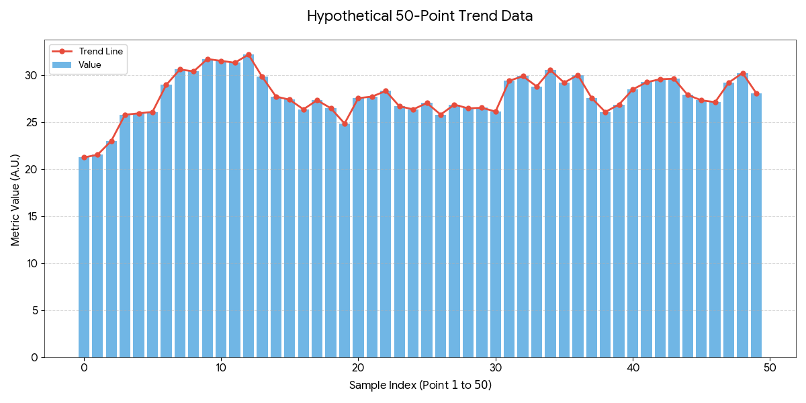

<!-- Just a nonsensical example of a long nonnarrative work: think nonfiction;
like a howto guide or whatever. The default formatting for this is still in
flux.

Copyright (c) Todd Warner
This work is licensed under Attribution 4.0 International. To view a copy of
this license, visit <http://creativecommons.org/licenses/by/4.0/>.
-->

<article id="manuscript" class="long nonnarrative">

Acme Research Inc.

123 Acme Ln, Washington, DC

555-555-1212

sayhello@example.com

25,000 words

# How To Do A Thing

<section class="chapter">

# What Is This Thing About?

<section class="scene no-dinkus">

<!-- maybe we need to allow scene titles in the future -->

# Introduction

Lorem ipsum dolor sit amet, consectetur adipiscing elit. Aliquam ac rutrum libero, at porta leo. Mauris ullamcorper sollicitudin lectus, vitae tempus mauris. Duis pellentesque faucibus purus, sit amet mattis lectus aliquam a. Mauris imperdiet mi vitae dictum euismod. Sed vitae leo sed risus feugiat lobortis. Cras et est sed magna finibus consequat id vitae lorem. Sed id arcu ex. Donec sed ligula at libero finibus ornare. Phasellus pulvinar, lectus id aliquet finibus, sapien ligula volutpat mauris, pellentesque blandit massa ante sit amet nunc. Duis eleifend sapien ut placerat vestibulum. Ut euismod, nisl a dignissim tincidunt, purus eros euismod mi, sit amet sollicitudin turpis lorem in massa. Praesent fringilla in diam a egestas. Donec ut placerat justo. Mauris et vulputate nisl.

</section><section class="scene no-dinkus">

### The Problem

Vestibulum sit amet enim consectetur nulla mollis pharetra. Morbi sodales arcu eu enim ultricies, quis dictum risus hendrerit. Maecenas volutpat, nibh non tempus dictum, quam dolor ornare dolor, dapibus semper mauris augue id enim. Suspendisse luctus rutrum odio nec maximus. Donec ut dolor in ipsum suscipit auctor vel id ex. Etiam et erat eu turpis vehicula gravida. Fusce ut sapien pretium, lobortis nisi sed, vestibulum est. Donec mattis mauris lectus, ac tincidunt dui sagittis sed. Sed non arcu ornare, volutpat mi vel, porttitor tortor. Etiam laoreet nibh eu odio commodo convallis. Vestibulum nec metus id nibh hendrerit bibendum et eu velit.

- Aliquam sed odio id tortor gravida tempus nec.[1][f1]
- Mauris vel mi viverra, consectetur turpis eget.[2][f2]
- Integer sed maximus metus.
- Integer posuere facilisis velit ut sollicitudin.
- Aliquam tempus purus sed elementum auctor.
- Pellentesque sed quam pretium, lobortis erat.

[f1]: #notes
[f2]: #notes

Cras efficitur nunc ligula, vitae pellentesque turpis scelerisque ac. Sed auctor purus eros, in varius erat eleifend in. Sed ornare, orci sit amet sagittis eleifend, sapien enim aliquam orci, a consectetur tellus nulla quis ante. Duis cursus scelerisque sapien, a vehicula nisi pellentesque eu. Sed convallis tristique dolor. Fusce nec purus vel elit fringilla pellentesque. Mauris a lacus felis. Cras et tristique lacus. Proin fringilla velit id consectetur lobortis. 

</section>
</section><section class="chapter">

# The Solution

<section class="scene">

Fusce et nibh vel tellus pretium porta nec eget est. Nunc vel lectus non dolor posuere ullamcorper sed pharetra dui. Fusce scelerisque tempus dolor sed convallis. Maecenas ut lorem sem. Curabitur dapibus lorem et metus mollis, quis aliquet turpis accumsan. Orci varius natoque penatibus et magnis dis parturient montes, nascetur ridiculus mus. Duis lobortis turpis pulvinar, ullamcorper eros nec, suscipit dolor. Nullam vitae urna porttitor, rutrum sem vitae, sagittis erat. Duis pulvinar lacus egestas semper finibus.

Steps:

1. This step.
2. This other step.
   1. Substep.
   2. Another substep.
3. A final step.

Curabitur at tellus efficitur, vestibulum lorem sit amet, tincidunt elit. Etiam volutpat massa in viverra finibus. Donec sit amet nunc enim. Nam magna massa, lacinia tincidunt dolor pretium, lacinia tincidunt sem. Cras quis consequat nisl. Duis sit amet hendrerit enim. Suspendisse pellentesque odio vel lacus rutrum, eu elementum neque lobortis. Vestibulum massa sapien, placerat in sapien eu, tempor efficitur leo. Phasellus quis sagittis diam.

Etiam nec odio congue, varius lorem vel, volutpat diam. Donec eget ipsum arcu. Donec varius interdum elementum. Aliquam scelerisque quis neque non suscipit. Fusce iaculis condimentum sapien non sollicitudin. Donec magna leo, faucibus vitae condimentum sed, efficitur at quam. Suspendisse ligula orci, vulputate a nunc vel, efficitur facilisis turpis. Vivamus cursus sagittis quam, at bibendum est sollicitudin eu. Proin at sollicitudin lacus. Donec pretium eu velit volutpat ultrices. Duis eu consequat felis. Sed vel tellus placerat, sollicitudin nunc et, condimentum diam. In eget felis tincidunt, facilisis magna in, laoreet magna. Sed ultricies elit nec justo hendrerit suscipit. Maecenas congue orci ut massa pulvinar, vel scelerisque elit faucibus. 

</section>
</section><section class="chapter">

# Conclusion and Notes

<section class="scene no-dinkus">

### Conclusion

Mauris egestas urna ac lacinia efficitur. Fusce ut nisi quam. Vestibulum ante velit, volutpat eu finibus sit amet, lacinia vitae metus. Fusce tortor elit, sagittis in ante at, faucibus finibus nunc. Etiam aliquet augue ut laoreet lobortis. Fusce at convallis ligula. Maecenas lorem metus, pharetra eu consectetur a, rhoncus vel nisi. Etiam tristique ex eget turpis euismod, eget ultrices orci eleifend. Sed sit amet sapien ac ligula bibendum tempor at consectetur nisl. Praesent ac blandit odio, ut auctor eros. Pellentesque ultricies turpis ac scelerisque luctus. Interdum et malesuada fames ac ante ipsum primis in faucibus. Proin ullamcorper vitae dolor non vulputate. Integer sed orci et lectus tristique pulvinar eu sed elit. Sed blandit dui eget dui ullamcorper, at tempus ligula tristique.

Cras auctor, ipsum vel iaculis malesuada, urna enim congue diam, id rutrum est justo ac sapien. Nunc finibus massa ut ipsum sagittis laoreet. Etiam scelerisque laoreet lacus. Maecenas sit amet orci fringilla, dictum nisl eget, aliquet quam. Donec sit amet euismod enim, sit amet lobortis eros. Aenean lacus nunc, suscipit eget cursus in, porttitor nec risus. Pellentesque dignissim ornare tellus, sit amet fringilla sapien faucibus eget. Sed venenatis eleifend accumsan. Praesent mattis posuere viverra. Proin pharetra congue urna.

</section><section id="notes" class="scene foothang">

### Notes

1\. This is a footnote. Integer accumsan turpis et est mollis, eget ornare quam laoreet. Donec dictum volutpat risus, ac finibus mauris varius a. Vestibulum tristique commodo lectus, a ultrices elit bibendum sed. Nam a hendrerit ipsum.

2\. This is a footnote. Nam non lectus ligula. In metus metus, pellentesque non eros eget, pulvinar pellentesque lectus. 

</section>
</section>

</article>

